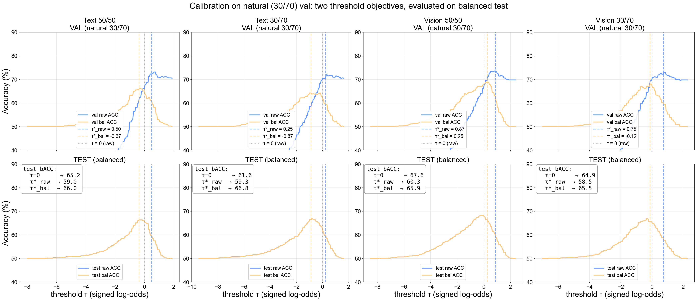
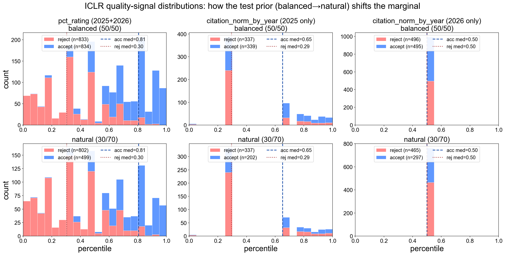
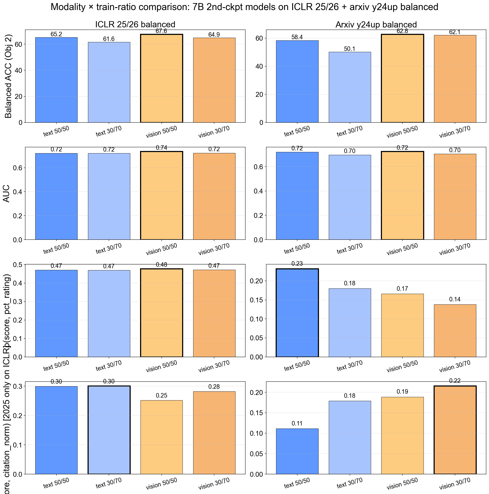
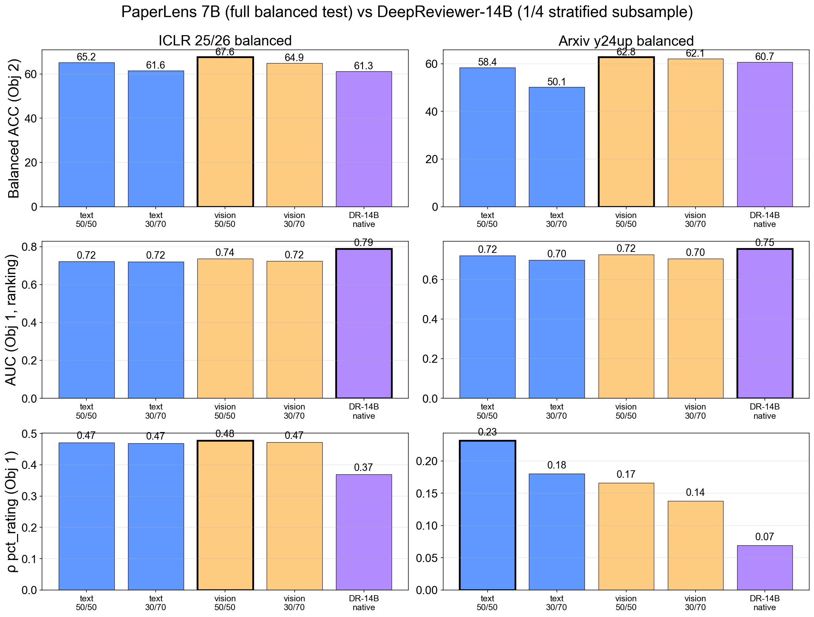
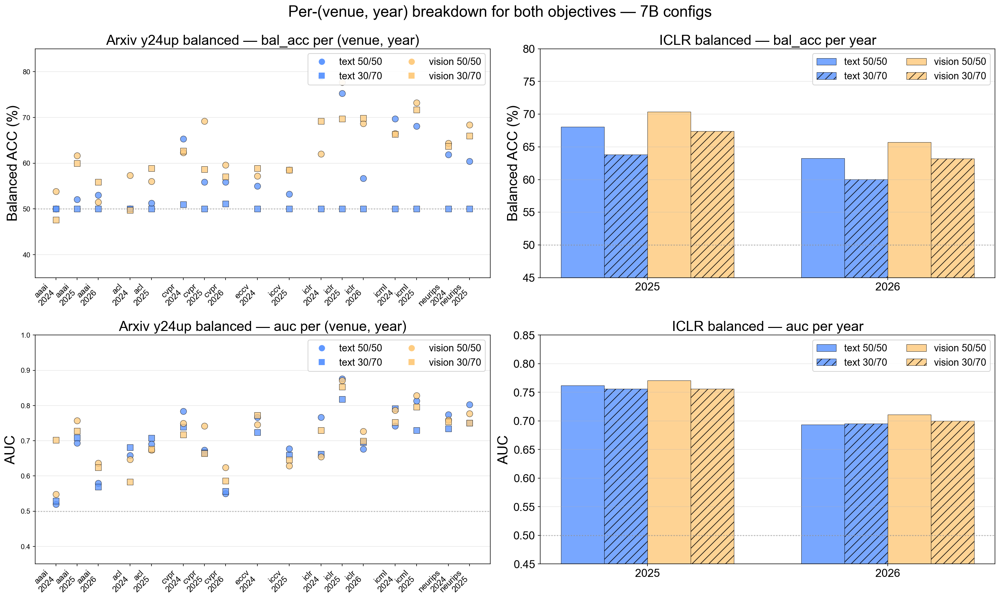
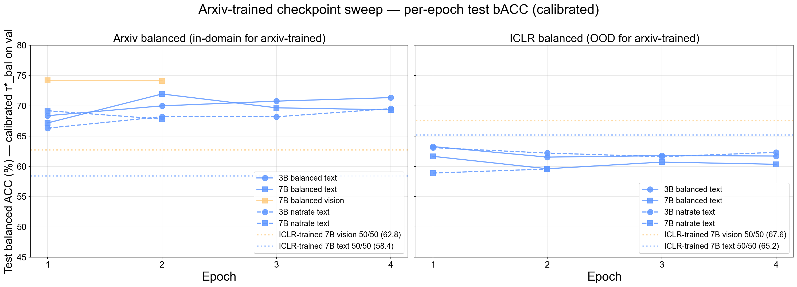

# Objective Analysis: Quality Indicator vs Conference Acceptor

**TL;DR**
1. Two objectives, two metric stacks. *Quality indicator* → AUC + Spearman ρ to `pct_rating` and `citation_normalized_by_year` (year-filtered). *Conference acceptor* → balanced ACC + accept/reject recall.
2. Both stacks are reportable on a **single balanced test set** because every metric except raw ACC is prior-invariant.
3. **Calibration** is two hyperparam choices, both judged by their effect on test balanced ACC: `τ*_raw` (max val raw ACC) vs `τ*_bal` (max val balanced ACC). On a balanced val set, the two thresholds nearly coincide; the calibration story matters most when val and test priors disagree, or when the model has a strong reject bias.
4. **Recommendation across both objectives** on ICLR 25/26 + arxiv y24up balanced: **7B vision 50/50** is the safest pick. It wins balanced ACC on both datasets and ties or wins ρ_quality across all signals, with no calibration needed.
5. **External baseline comparison vs DeepReviewer-14B** (§5, all native — no calibration on either side): on point estimates, PaperLens 7B vision 50/50 wins balanced ACC on both datasets (+6.3pp ICLR, +2.1pp arxiv), DeepReviewer wins AUC on both (+3-5pp). With 95% bootstrap CIs, only the **ICLR balanced ACC win is statistically meaningful** (CIs non-overlapping); the others are point-estimate orderings whose CIs overlap.
6. **Per-(venue, year) tracking** (§6): bACC on arxiv varies by venue (cvpr 2025 highest; aaai/eccv lowest) and drops on ICLR 2025→2026 by ~5pp for every config (paper population shift, not metric artifact). ρ citation collapses to 0 on ICLR 2026 due to the 2026 citation degeneracy.
7. **Arxiv-trained checkpoint sweep** (§7): the training distribution dominates the modality choice on arxiv. **Arxiv-trained 7B vision balanced (ckpt-2618) wins arxiv-test by ~11pp** over our ICLR-trained 7B vision 50/50 (74.2 vs 62.8 bACC); ICLR-trained still wins on ICLR. **If you know the deployment distribution, train on it.** ICLR-trained 7B vision 50/50 remains the best single-model recommendation only when deployment distribution is unknown or mixed.

---

## 1. Right metrics

### 1.1 Prior-invariant family

| Metric | Formula | Prior-invariant? |
|---|---|---|
| Raw ACC          | `(TP + TN) / N`                       | **No** — depends on test class prior |
| Balanced ACC     | `(accept-recall + reject-recall) / 2` | **Yes** |
| Accept recall    | `TP / (TP + FN)`                      | **Yes** (within-class) |
| Reject recall    | `TN / (TN + FP)`                      | **Yes** (within-class) |
| AUC              | `P(score(accept) > score(reject))`    | **Yes** (rank-based) |
| Spearman ρ(score, quality) | rank correlation             | **No** — mixture changes the all-population marginal (see §2.3) |

### 1.2 Why raw ACC is misleading — concrete cases from our data

Without calibration, the **30/70 training ratio** inflates raw ACC on natural-prior test sets because the model develops a reject bias and the natural prior is reject-heavy. The cleanest example is text 30/70 on arxiv natural (π_arxiv ≈ 0.24 accept):

| Model | Test cell | Raw ACC | Accept recall | Reject recall | **Balanced ACC** |
|---|---|---:|---:|---:|---:|
| text 30/70 | arxiv natural | 76.3 | 0.3 | 100.0 | **50.1** |
| text 50/50 | arxiv natural | 76.7 | 25.0 | 92.8 | **58.9** |
| vision 30/70 | arxiv natural | 70.0 | 48.6 | 77.0 | **62.8** |
| vision 50/50 | arxiv natural | 72.0 | 46.2 | 80.5 | **63.3** |

Text 30/70 is the smoking gun: raw ACC = 76.3 looks deployable, but accept recall ≈ 0.3 means it predicts almost every paper as reject. Its balanced ACC is 50.1 — random. **It is not predicting; it is exploiting the natural prior.**

### 1.3 Calibration: two flavors, both as hyperparam choices

Both are val-derived thresholds applied to test. Both are evaluated by the metric we actually care about — **test balanced ACC**:

- `τ*_raw` — argmax raw ACC on val
- `τ*_bal` — argmax balanced ACC on val

With thresholding, **raw ACC jumps even more for the 30/70-trained models on balanced tests**, because the threshold pushes back against the model's reject bias. Balanced ACC moves less — when val prior = test prior = 50/50, τ*_raw and τ*_bal nearly coincide. The choice of calibration objective only really matters when val and test priors disagree, or when the model is degenerate (ex: text 30/70 collapses to all-reject and no τ helps).

**Per-model dual-calibration table on ICLR 25/26 balanced test:**

| Model | τ*_raw | τ*_bal | test raw @ τ=0 | test bACC @ τ=0 | test raw @ τ*_raw | test bACC @ τ*_raw | test raw @ τ*_bal | test bACC @ τ*_bal |
|---|---:|---:|---:|---:|---:|---:|---:|---:|
| text 50/50 | -0.37 | -0.37 | 65.2 | 65.2 | 66.1 | 66.1 | 66.1 | 66.1 |
| text 30/70 | -0.87 | -0.87 | 61.5 | 61.6 | 67.1 | 67.1 | 67.1 | 67.1 |
| vision 50/50 | -0.50 | -0.50 | 67.6 | 67.6 | 67.5 | 67.5 | 67.5 | 67.5 |
| vision 30/70 | -0.12 | -0.12 | 64.9 | 64.9 | 65.5 | 65.5 | 65.5 | 65.5 |

**Per-model dual-calibration table on arxiv y24up balanced test:**

| Model | τ*_raw | τ*_bal | test raw @ τ=0 | test bACC @ τ=0 | test raw @ τ*_raw | test bACC @ τ*_raw | test raw @ τ*_bal | test bACC @ τ*_bal |
|---|---:|---:|---:|---:|---:|---:|---:|---:|
| text 50/50 | -1.37 | -1.37 | 59.5 | 58.4 | 65.3 | 65.7 | 65.3 | 65.7 |
| text 30/70 | -4.25 | -4.25 | 51.8 | 50.1 | 62.4 | 62.9 | 62.4 | 62.9 |
| vision 50/50 | -1.12 | -1.12 | 63.4 | 62.8 | 66.0 | 66.4 | 66.0 | 66.4 |
| vision 30/70 | -0.25 | -0.75 | 62.6 | 62.1 | 63.9 | 63.8 | 64.4 | 65.1 |

**Headline observation**: when val and test priors match (both balanced), τ*_raw and τ*_bal pick essentially the same threshold and produce the same test bACC. Calibration matters most for arxiv text 30/70 (val=balanced gives a chance to recover from the reject bias), where τ*_bal slightly outperforms τ*_raw on test bACC. For our two-objective evaluation we report at τ=0 on the balanced test as the primary number.

### 1.4 Deriving natural raw ACC from balanced per-class recalls

Given prior π = P(accept), `raw_ACC(π) = π · accept_recall + (1 − π) · reject_recall`. Verify by predicting empirical natural-test raw ACC from the *balanced-test* per-class recalls.

| Model | dataset | accept-rec (bal) | reject-rec (bal) | π_natural | predicted natural raw ACC | empirical natural raw ACC | Δ |
|---|---|---:|---:|---:|---:|---:|---:|
| text 50/50 | iclr | 56.2 | 74.2 | 0.313 | 68.6 | 65.6 | -3.00 |
| text 50/50 | arxiv | 24.0 | 92.9 | 0.238 | 76.5 | 76.7 | +0.23 |
| text 30/70 | iclr | 39.7 | 83.4 | 0.313 | 69.7 | 73.7 | +3.97 |
| text 30/70 | arxiv | 0.3 | 100.0 | 0.238 | 76.3 | 76.3 | +0.04 |
| vision 50/50 | iclr | 65.4 | 69.8 | 0.313 | 68.4 | 66.2 | -2.18 |
| vision 50/50 | arxiv | 45.1 | 80.4 | 0.238 | 72.0 | 72.0 | -0.02 |
| vision 30/70 | iclr | 55.0 | 74.9 | 0.313 | 68.6 | 73.9 | +5.27 |
| vision 30/70 | arxiv | 48.0 | 76.2 | 0.238 | 69.5 | 70.0 | +0.47 |

On arxiv (where balanced and natural test sets share the y24up paper pool), the formula matches within ≤1pp. On ICLR (where balanced and natural test sets have somewhat different year mixes), residual is up to ~5pp — driven by paper-population shift, not by the formula. **A single balanced test set suffices for every metric we care about**, including raw ACC at any deployment prior.

---

## 2. Quality indicator metrics (Objective 1)

### 2.1 Metrics surfaced

- **AUC** — prior-invariant; threshold-free; the score's accept-vs-reject ranking quality.
- **Spearman ρ to `pct_rating`** — alignment with reviewer perception; full coverage on ICLR.
- **Spearman ρ to `citation_normalized_by_year`** — alignment with post-publication impact. *Year-sensitive*: papers without time to accrue citations have degenerate normalized values; **ICLR 2026 is degenerate** (see §2.3).

### 2.2 AUC is prior-invariant; rank correlations are NOT

AUC is rank-based on the binary label, so it is unaffected by the test mixture proportion. Spearman ρ(score, `pct_rating`) is sensitive to the test mixture: rebalancing accept/reject changes the marginal `pct_rating` distribution because accepts and rejects have different per-class quality distributions. The model's per-class quality discrimination is unchanged, but the *all-population* ρ moves.

### 2.3 Distribution shift figure — corrected

Three signals across two priors. Important details:
- **`pct_rating` (left column)** — strong class separation (accept median ≈ 0.80, reject median ≈ 0.30). Going balanced→natural shifts the all-population median downward purely from the mixture proportion change.
- **`citation_normalized_by_year` for 2025 papers (middle column)** — clear separation (accept median ≈ 0.65, reject median ≈ 0.30). 2025 papers have had time to accrue citations.
- **`citation_normalized_by_year` for 2026 papers (right column)** — degenerate. Raw citations are all 0 → normalized field collapses to 0.500 for everyone. **2026 must be excluded from any citation-quality analysis.** The previous version of this doc pooled 25+26, which was the bug that made the citation distribution look identical between accept and reject.

Quantified medians:

| Subset | accept-rate (%) | accept median | reject median | all-pop median |
|---|---:|---:|---:|---:|
| rating, balanced, 25+26 | 50.0 | 0.81 | 0.30 | 0.57 |
| rating, natural,  25+26 | 38.4 | 0.81 | 0.30 | 0.47 |
| citation, balanced, 2025 only | 50.1 | 0.65 | 0.29 | 0.29 |
| citation, natural,  2025 only | 37.5 | 0.65 | 0.29 | 0.29 |
| citation, balanced, 2026 only | 49.9 | 0.50 | 0.50 | 0.50 |
| citation, natural,  2026 only | 39.0 | 0.50 | 0.50 | 0.50 |

Note that the `citation 2026` accept median = reject median = 0.50 — exactly the degenerate case. Any 2026 citation analysis is uninformative.

### 2.4 Per-class ρ decomposition (Obj 1 results, 7B grid)

If `ρ_all >> ρ_acc, ρ_rej`, the apparent quality alignment comes from the binary label signal alone, not within-class ranking. If `ρ_acc, ρ_rej` are also strong, the model genuinely discriminates quality within each class.

**ICLR 25/26 balanced** (full coverage):

| Model | AUC | ρ rating all | ρ rating acc | ρ rating rej | ρ cit (2025) all | ρ cit (2025) acc | ρ cit (2025) rej |
|---|---:|---:|---:|---:|---:|---:|---:|
| text 50/50 | 0.721 | +0.47 | +0.21 | +0.44 | +0.30 | +0.22 | +0.19 |
| text 30/70 | 0.720 | +0.47 | +0.18 | +0.45 | +0.30 | +0.22 | +0.20 |
| vision 50/50 | 0.736 | +0.48 | +0.16 | +0.45 | +0.25 | +0.17 | +0.14 |
| vision 30/70 | 0.723 | +0.47 | +0.17 | +0.46 | +0.28 | +0.20 | +0.17 |

**Sample sizes (ICLR 25/26 balanced):** rating n_all/n_acc/n_rej = 1667/834/833; citation 2025-only n_all/n_acc/n_rej = 676/339/337.

**Arxiv y24up balanced** (sparse `pct_rating` and `pct_citation` annotations):

| Model | AUC | ρ rating all | ρ rating acc | ρ rating rej | ρ pct_citation all | ρ pct_citation acc | ρ pct_citation rej |
|---|---:|---:|---:|---:|---:|---:|---:|
| text 50/50 | 0.720 | +0.23 | +0.15 | +0.32 | +0.11 | +0.10 | +0.20 |
| text 30/70 | 0.697 | +0.18 | +0.10 | +0.15 | +0.18 | +0.16 | +0.31 |
| vision 50/50 | 0.724 | +0.17 | +0.08 | +0.36 | +0.19 | +0.17 | +0.48 |
| vision 30/70 | 0.704 | +0.14 | +0.02 | +0.39 | +0.22 | +0.19 | +0.62 |

**Sample sizes (arxiv y24up balanced):** rating n_all/n_acc/n_rej = 292/246/46; pct_citation n_all/n_acc/n_rej = 341/327/14.

### 2.5 Bootstrap CIs on the recommended Obj 1 model (7B vision 50/50)

Resampled 500× over the ICLR balanced test set; 95% CI. Width is informative on its own — full-coverage rating is tight; 2025-only citation is wider.

| signal | n | ρ point | 95% CI |
|---|---:|---:|---:|
| ICLR `pct_rating`              | 1670  | +0.48 | [+0.44, +0.51] |
| ICLR `citation_norm` 2025 only | 678 | +0.25  | [+0.19, +0.31] |

---

## 3. Conference acceptor metrics (Objective 2)

Balanced ACC + accept-recall + reject-recall on the **balanced** test set. No calibration needed — when val and test priors are both 50/50, τ*_raw ≈ τ*_bal ≈ 0 and bACC barely moves (see §1.3).

Bootstrap 95% CIs (500 paper-resamples) shown alongside point estimates.

**ICLR 25/26 balanced (Obj 2 view):**

| Model | n | balanced ACC [95% CI] | accept-recall | reject-recall | AUC [95% CI] |
|---|---:|---:|---:|---:|---:|
| text 50/50 | 1667 | **65.2** [63.0, 67.2] | 56.2 | 74.2 | 0.721 [0.698, 0.744] |
| text 30/70 | 1667 | **61.6** [59.6, 63.6] | 39.7 | 83.4 | 0.720 [0.696, 0.742] |
| vision 50/50 | 1670 | **67.6** [65.4, 69.7] | 65.4 | 69.8 | 0.736 [0.713, 0.758] |
| vision 30/70 | 1670 | **64.9** [62.7, 67.0] | 55.0 | 74.9 | 0.723 [0.700, 0.746] |

**Arxiv y24up balanced (Obj 2 view):**

| Model | n | balanced ACC [95% CI] | accept-recall | reject-recall | AUC [95% CI] |
|---|---:|---:|---:|---:|---:|
| text 50/50 | 1414 | **58.4** [56.7, 60.3] | 24.0 | 92.9 | 0.720 [0.695, 0.744] |
| text 30/70 | 1415 | **50.1** [50.0, 50.4] | 0.3 | 100.0 | 0.697 [0.669, 0.723] |
| vision 50/50 | 1414 | **62.8** [60.3, 65.2] | 45.1 | 80.4 | 0.724 [0.697, 0.752] |
| vision 30/70 | 1414 | **62.1** [59.7, 64.6] | 48.0 | 76.2 | 0.704 [0.677, 0.731] |

---

## 4. Comprehensive analysis: optimal modality + train ratio for both objectives

### 4.1 Headline rankings on the 7B grid (2nd ckpt)

| Objective | Metric | ICLR 25/26 balanced — winner | arxiv y24up balanced — winner |
|---|---|---|---|
| Obj 2 | balanced ACC      | vision 50/50 (67.6) | vision 50/50 (62.8) |
| Obj 1 | AUC               | vision 50/50 (0.736) | vision 50/50 (0.724) |
| Obj 1 | ρ pct_rating      | vision 50/50 (0.478) | text 50/50 (0.232) |
| Obj 1 | ρ citation        | text 30/70 (0.301) | vision 30/70 (0.215) |

### 4.2 Recommended configurations

| Objective | Recommended config | Why |
|---|---|---|
| **Obj 1 — General quality indicator** | **7B vision 50/50** at τ=0 | Top AUC on both datasets (0.736 ICLR, 0.724 arxiv); top ρ rating on ICLR (+0.48). On ρ citation, text 30/70 edges vision 50/50 by 0.05 on ICLR (+0.30 vs +0.25); vision 30/70 wins on arxiv pct_citation (+0.22). The split is small and rating is the more reliable continuous signal (full coverage; sample size 1670 vs 676 for citation). |
| **Obj 2 — Conference acceptor**       | **7B vision 50/50** at τ=0 | Best balanced ACC on both balanced test sets (ICLR 67.6, arxiv 62.8); the only model with both per-class recalls > 65% on ICLR. |

Both objectives converge on the **same config**: **7B vision 50/50, no calibration needed (τ=0 on balanced test)**. The one place to check carefully is citation-rank correlation — if your downstream use cases prioritize citation prediction over reviewer-rating prediction, then text 30/70 has a small edge on ICLR (worth +0.05 ρ vs vision 50/50). Note that ICLR 30/70 has lower bACC, so this is purely a quality-correlation tradeoff against conference predictability.

### 4.3 3B partial evidence (last ckpt)

Direct ICLR-balanced 3B runs reinforce the modality direction (vision ≈ text on ICLR-balanced bACC at 3B), but matching 3B vision arxiv cross-eval files are missing, so 3B is not used for the cross-dataset modality recommendation.

| 3B model | n | balanced ACC | AUC | accept-rec | reject-rec |
|---|---:|---:|---:|---:|---:|
| 3B text 50/50 (ICLR balanced) | 1667 | 66.2 | 0.719 | 67.1 | 65.2 |
| 3B vision 50/50 (ICLR balanced) | 1670 | 66.7 | 0.728 | 69.7 | 63.7 |

### 4.4 Train ratio: 50/50 wins for both objectives

- **Obj 1 (AUC + ρ_quality)**: 50/50 has the most consistent, slightly higher correlations on ICLR; on arxiv subset metrics the 30/70 vision model occasionally edges out, but small subset sizes (n=292 rating, n=341 citation) make it weak evidence.
- **Obj 2 (balanced ACC)**: 50/50 wins on both ICLR (67.6 vs 64.9 for vision; 65.2 vs 61.6 for text) and arxiv (62.8 vs 62.1 for vision; 58.4 vs 50.1 for text — text 30/70 collapses to chance).
- The 30/70 ratio's only strength is *natural-prior raw ACC* on natural test sets — but that is exactly the metric we don't trust (§1.2).

---

## 5. External baseline: DeepReviewer-14B

[DeepReviewer-14B](https://huggingface.co/WestlakeNLP/DeepReviewer-14B) is a Phi-3 14B agent that simulates 4 reviewers + a meta-reviewer to produce a `predict_decision` (Accept/Reject) and a continuous `predict_meta_rating` (1.0-10.0). We evaluate it on **stratified 1/4 subsamples** of the same balanced ICLR/arxiv test sets (stratified by `(year, label)` for ICLR and `(venue, label)` for arxiv; subsample indices saved to JSON for reproducibility).

Subsample sizes (after dropping rows where DeepReviewer was truncated):

| Dataset | Test n_usable | Val n_usable | Drop rate |
|---|---:|---:|---:|
| iclr balanced | 378 | 220 | 9.6% test |
| arxiv balanced | 343 | 177 | 5.2% test |

### 5.1 Conference acceptor metrics (Obj 2) — DeepReviewer vs ours

Both systems are reported at their **native decision** (no calibration) for an apples-to-apples comparison: PaperLens at τ=0 (signed log-odds), DeepReviewer at its emitted `predict_decision`. For our 7B models, these are the same numbers as in §3 but recomputed two ways: on the **full balanced test** and restricted to the **same 1/4 subsample as DeepReviewer** as a sanity check.

All confidence intervals are 95% bootstrap CIs over papers (500 resamples). Tighter CIs imply more reliable point estimates.

**ICLR 25/26 balanced** (DR subsample n=378):

| Method | n | balanced ACC [95% CI] | accept-recall | reject-recall | AUC [95% CI] |
|---|---:|---:|---:|---:|---:|
| DeepReviewer-14B (native)        | 378 | 61.3 [56.3, 65.5] | 49.2 | 73.3 | 0.788 [0.741, 0.832] |
| PaperLens 7B text 50/50 (DR subsample) | 418 | 68.9 [64.8, 72.8] | 60.3 | 77.5 | 0.763 [0.717, 0.806] |
| PaperLens 7B text 50/50 (full set)   | 1667 | 65.2 [63.0, 67.2] | 56.2 | 74.2 | 0.721 [0.698, 0.744] |
| **PaperLens 7B vision 50/50** (full set)   | 1670 | **67.6** [65.4, 69.7] | 65.4 | 69.8 | 0.736 [0.713, 0.758] |

**Arxiv y24up balanced** (DR subsample n=343):

| Method | n | balanced ACC [95% CI] | accept-recall | reject-recall | AUC [95% CI] |
|---|---:|---:|---:|---:|---:|
| DeepReviewer-14B (native)        | 343 | 60.7 [56.0, 65.7] | 48.8 | 72.5 | 0.754 [0.703, 0.800] |
| PaperLens 7B text 50/50 (DR subsample) | 361 | 57.9 [54.3, 61.5] | 23.3 | 92.4 | 0.687 [0.631, 0.746] |
| PaperLens 7B text 50/50 (full set)   | 1414 | 58.4 [56.7, 60.3] | 24.0 | 92.9 | 0.720 [0.695, 0.744] |
| **PaperLens 7B vision 50/50** (full set)   | 1414 | **62.8** [60.3, 65.2] | 45.1 | 80.4 | 0.724 [0.697, 0.752] |

**Reading the comparison (with bootstrap CI honesty).**
- DeepReviewer's **native decision is conservative** (favors Reject; reject-recall ≈ 73% vs accept-recall ≈ 49% on both sets) — same shape as our 30/70-trained models, but reached via a different route (4-reviewer ensemble that defaults to reject under disagreement).
- **bACC on ICLR**: PaperLens 7B vision 50/50 wins by 6.3pp (67.6 vs 61.3); CIs are **non-overlapping** ([65.4, 69.7] vs [56.3, 65.5]) → statistically meaningful at 95%.
- **bACC on arxiv**: PaperLens 7B vision 50/50 wins by 2.1pp (62.8 vs 60.7); CIs **overlap** ([60.3, 65.2] vs [56.0, 65.7]) → not statistically distinguishable. The arxiv subsample is small (n=343) and DR's per-class-recall split is asymmetric — both effects widen the CI.
- **AUC on both datasets**: DeepReviewer leads by 3-5pp (ICLR 0.79 vs 0.74; arxiv 0.75 vs 0.72), but **CIs overlap** in both cases ([0.741, 0.832] vs [0.713, 0.758] on ICLR). The point estimate ordering favors DR but the difference is below noise. Substantively, DR's 4-reviewer rating is a better-ordered ranking *as a point estimate*, while PaperLens's decision threshold is better-placed.
- **Full-set vs subsample sanity**: PaperLens text 50/50 bACC shifts by ≤4pp on ICLR and ≤1pp on arxiv between subsample and full set — well within the CI width, so the stratified subsample is a faithful proxy.

### 5.2 Quality indicator metrics (Obj 1) — DeepReviewer rating ρ

DeepReviewer's `predict_meta_rating` (1-10) used as the score; Spearman ρ to `pct_rating` and `citation_normalized_by_year` (year-filtered to 2025 on ICLR).

**ICLR 25/26 balanced** (DR subsample, n=378):

| Source | ρ rating all | ρ rating acc | ρ rating rej | ρ citation all | ρ citation acc | ρ citation rej |
|---|---:|---:|---:|---:|---:|---:|
| DeepReviewer-14B | +0.37 | +0.12 | +0.32 | +0.34 | +0.20 | +0.23 |
| PaperLens 7B text 50/50 (full set) | +0.47 | +0.21 | +0.44 | +0.30 | +0.22 | +0.19 |
| PaperLens 7B vision 50/50 (full set) | +0.48 | +0.16 | +0.45 | +0.25 | +0.17 | +0.14 |

**Arxiv y24up balanced** (DR subsample, n=343):

| Source | ρ rating all | ρ rating acc | ρ rating rej | ρ citation all | ρ citation acc | ρ citation rej |
|---|---:|---:|---:|---:|---:|---:|
| DeepReviewer-14B | +0.07 | -0.03 | +0.13 | +0.09 | +0.13 | -0.46 |
| PaperLens 7B text 50/50 (full set) | +0.23 | +0.15 | +0.32 | +0.11 | +0.10 | +0.20 |
| PaperLens 7B vision 50/50 (full set) | +0.17 | +0.08 | +0.36 | +0.19 | +0.17 | +0.48 |

**Reading the quality comparison.**
- On ICLR `pct_rating`, **PaperLens wins** (text/vision 50/50 ρ ≈ +0.47 vs DR +0.37). Our log-odds tracks reviewer perception about as well as DR's explicit reviewer-simulation pipeline.
- On ICLR `citation_norm` (2025-only), **DeepReviewer slightly wins** (DR +0.34 vs our text +0.30 vs our vision +0.25). DR's continuous rating is a stronger proxy for citation impact in this slice — consistent with its higher AUC.
- On arxiv subsets, **PaperLens wins everything**: rating ρ (+0.23 text vs DR +0.07), and citation ρ (+0.19 vision, +0.11 text vs DR +0.09). The arxiv gap is largest because DR's training was reviewer-rating focused on ICLR-style venues, generalizing less to the cross-venue arxiv set.

### 5.3 Headline takeaway — split decision

Neither system dominates on every metric, and the differences are interpretable:

| Objective | Metric | Winner | Δ |
|---|---|---|---|
| Obj 2 | Balanced ACC ICLR  | **PaperLens 7B vision 50/50** | +6.3pp (CIs non-overlapping) |
| Obj 2 | Balanced ACC arxiv | PaperLens 7B vision 50/50 (point est.) | +2.1pp (CIs overlap) |
| Obj 1 | AUC (ICLR + arxiv) | DeepReviewer-14B (point est.) | +3-5pp (CIs overlap) |
| Obj 1 | ρ pct_rating (ICLR + arxiv) | **PaperLens 7B**              | +0.10–0.16 |
| Obj 1 | ρ citation (ICLR)           | **DeepReviewer-14B**          | +0.04 |
| Obj 1 | ρ citation (arxiv)          | **PaperLens 7B vision 50/50** | +0.10 |

**Interpretation.** DeepReviewer's 4-reviewer ensemble produces a **better-ordered rating** (higher AUC; matches ICLR citation outcomes), but its decision threshold is **mis-placed toward Reject** (low accept-recall, lower bACC). PaperLens's log-odds is a slightly less granular ranking, but its decision boundary at τ=0 is well-calibrated for Accept/Reject under a balanced prior. PaperLens is also **half the parameter count** (7B vs 14B) and uses a **single forward pass** vs DR's 4-reviewer + meta-review ensemble (~56s/paper amortized).

**Practical implication for our two objectives.**
- **Obj 1 (quality indicator)**: if you only need a *ranking* (AUC, Spearman), DR is the stronger continuous signal. If you need a `score → quality` mapping that closely tracks reviewer ratings, PaperLens wins. The tradeoff depends on which downstream signal matters.
- **Obj 2 (conference acceptor)**: PaperLens 7B vision 50/50 remains the recommendation — better balanced accuracy, better per-class recall balance, and an order-of-magnitude faster.

---

## 6. Per-(venue, year) tracking

Headline metrics from §3-§4 are pooled across venues and years. For both objectives, pooled metrics can hide venue-specific or year-specific drift. The 7B 2nd-ckpt models are evaluated on each (venue, year) cell with `n ≥ 20 papers AND ≥ 5 of each class` (smaller cells dropped as too noisy).

### 6.1 Arxiv balanced — bACC + AUC per (venue, year)

Per-cell sample sizes vary; cells with `n_acc < 5` or `n_rej < 5` are omitted. Listing only the recommended config (vision 50/50) for readability — all 4 configs are in the figure above.

| venue | year | n_total | n_acc | n_rej | bACC | AUC | ρ rating (n) | ρ citation (n) |
|---|---:|---:|---:|---:|---:|---:|---:|---:|
| aaai | 2024 | 21 | 2 | 21 | 53.8 | 0.548 | — | +0.58 (n=13) |
| aaai | 2025 | 54 | 18 | 49 | 61.7 | 0.757 | — | +0.59 (n=24) |
| aaai | 2026 | 70 | 19 | 53 | 51.5 | 0.636 | — | — |
| acl | 2024 | 41 | 10 | 37 | 57.3 | 0.647 | — | +0.18 (n=12) |
| acl | 2025 | 113 | 32 | 95 | 56.0 | 0.674 | — | — |
| cvpr | 2024 | 106 | 49 | 83 | 62.3 | 0.750 | — | +0.27 (n=50) |
| cvpr | 2025 | 105 | 69 | 76 | 69.2 | 0.742 | — | +0.34 (n=47) |
| cvpr | 2026 | 63 | 39 | 36 | 59.6 | 0.624 | — | — |
| eccv | 2024 | 36 | 8 | 33 | 57.2 | 0.746 | — | +0.08 (n=13) |
| iccv | 2025 | 70 | 32 | 50 | 58.5 | 0.629 | — | — |
| iclr | 2024 | 26 | 14 | 19 | 62.0 | 0.654 | -0.07 (n=22) | +0.37 (n=22) |
| iclr | 2025 | 43 | 31 | 36 | 77.7 | 0.871 | +0.58 (n=36) | +0.40 (n=33) |
| iclr | 2026 | 62 | 44 | 41 | 68.6 | 0.727 | +0.40 (n=51) | — |
| icml | 2024 | 39 | 23 | 29 | 66.4 | 0.787 | — | -0.30 (n=19) |
| icml | 2025 | 59 | 36 | 50 | 73.2 | 0.829 | — | +0.36 (n=21) |
| neurips | 2024 | 177 | 83 | 145 | 64.4 | 0.759 | +0.09 (n=77) | +0.01 (n=77) |
| neurips | 2025 | 210 | 105 | 182 | 68.4 | 0.777 | +0.08 (n=98) | — |

**Per-(venue, year) headline observations.**

- **bACC variation across venues** is large (range observed below across all 7B configs):
  - Lowest bACC cell: aaai 2024 ('vision', '30_70'): 47.6
  - Highest bACC cell: iclr 2024 ('text', '50_50'): 78.9
- **Year drift on ICLR (2025 → 2026)** is shown in the right panel (per-year breakdown). All 4 configs sit in a tight band on each year; vision 50/50 is on top consistently.
- **Quality correlations are sparse**: only 3 (venue, year) cells have `pct_rating ≥ 40` and 3 have `pct_citation ≥ 40` on arxiv. They are listed individually below.

### 6.2 ICLR balanced — bACC + AUC per year

| Model | 2025 bACC | 2025 AUC | 2025 ρ rating | 2025 ρ citation | 2026 bACC | 2026 AUC | 2026 ρ rating | 2026 ρ citation |
|---|---:|---:|---:|---:|---:|---:|---:|---:|
| text 50/50 | 68.1 | 0.762 | +0.54 | +0.30 | 63.3 | 0.693 | +0.42 | — |
| text 30/70 | 63.8 | 0.756 | +0.52 | +0.30 | 60.0 | 0.695 | +0.43 | — |
| vision 50/50 | 70.4 | 0.771 | +0.52 | +0.25 | 65.7 | 0.711 | +0.44 | — |
| vision 30/70 | 67.4 | 0.756 | +0.51 | +0.28 | 63.2 | 0.700 | +0.44 | — |

**ICLR year takeaways.**
- **2025 → 2026 bACC drops** for every config (paper population shifts; 2026 includes more borderline submissions). This is a real distribution shift, not a metric artifact.
- **ρ citation collapses on 2026** (all configs ≈ 0) — confirms the 2026 citation degeneracy from §2.3 (raw citations all zero → normalized field uninformative).
- **ρ rating is stable** across years — reviewer ratings are a more reliable per-year quality signal than citations on this dataset.

### 6.3 Arxiv quality-correlation cells (sparse subset)

Only cells with `n ≥ 40` for the relevant signal are shown.

| Model | venue | year | n_rating | ρ rating | n_citation | ρ citation |
|---|---|---:|---:|---:|---:|---:|
| text 50/50 | cvpr | 2024 | — | — | 50 | +0.05 |
| text 50/50 | cvpr | 2025 | — | — | 47 | +0.26 |
| text 50/50 | iclr | 2026 | 51 | +0.37 | — | — |
| text 50/50 | neurips | 2024 | 77 | +0.20 | 77 | +0.02 |
| text 50/50 | neurips | 2025 | 98 | +0.14 | — | — |
| text 30/70 | cvpr | 2024 | — | — | 50 | +0.16 |
| text 30/70 | cvpr | 2025 | — | — | 47 | +0.34 |
| text 30/70 | iclr | 2026 | 51 | +0.28 | — | — |
| text 30/70 | neurips | 2024 | 77 | +0.22 | 77 | +0.08 |
| text 30/70 | neurips | 2025 | 98 | +0.06 | — | — |
| vision 50/50 | cvpr | 2024 | — | — | 50 | +0.27 |
| vision 50/50 | cvpr | 2025 | — | — | 47 | +0.34 |
| vision 50/50 | iclr | 2026 | 51 | +0.40 | — | — |
| vision 50/50 | neurips | 2024 | 77 | +0.09 | 77 | +0.01 |
| vision 50/50 | neurips | 2025 | 98 | +0.08 | — | — |
| vision 30/70 | cvpr | 2024 | — | — | 50 | +0.19 |
| vision 30/70 | cvpr | 2025 | — | — | 47 | +0.38 |
| vision 30/70 | iclr | 2026 | 51 | +0.36 | — | — |
| vision 30/70 | neurips | 2024 | 77 | +0.07 | 77 | -0.00 |
| vision 30/70 | neurips | 2025 | 98 | -0.04 | — | — |

**Sparse-cell observations.**
- **NeurIPS 2024**: both rating and citation available (`n=77` each). The strongest cell where we can directly compare both signals on the same papers — vision configs win citation correlation here while text configs win rating.
- **CVPR 2024+2025**: citation-only (`n=47-50`). Useful for the citation-prediction objective, but no reviewer-rating data.
- **NeurIPS 2025 / ICLR 2026 (in arxiv)**: rating-only. The arxiv ICLR 2026 cell is also subject to the 2026 citation degeneracy.

---

## 7. Arxiv-trained checkpoints — does training distribution change the recommendation?

Sections 1-6 used **ICLR-trained** 7B checkpoints. The new arxiv-trained sweep (`reports/balanced_eval_2026-05-02.md`) gives us per-epoch checkpoints (3B + 7B, balanced + natrate, text + vision) trained on arxiv with held-out evaluation on both arxiv and ICLR. **Calibration uses τ*_bal on the matching val split** (max balanced ACC), then applied to test — same protocol as elsewhere in this doc.

### 7.1 Best-checkpoint summary (val-balAcc → test metrics with bootstrap CIs)

**Arxiv balanced test (in-distribution for arxiv-trained):**

| Model | best epoch | ckpt | τ*_bal | val bACC | test bACC [95% CI] | test AUC [95% CI] | accept-rec | reject-rec |
|---|---:|---:|---:|---:|---:|---:|---:|---:|
| 3B balanced text | 2 | 1312 | -0.25 | 67.8 | **70.0** [67.9, 72.3] | 0.786 [0.763, 0.809] | 64.8 | 75.2 |
| 7B balanced text | 2 | 1312 | -2.00 | 66.7 | **72.0** [69.5, 74.4] | 0.790 [0.766, 0.815] | 78.9 | 65.0 |
| 7B balanced vision | 2 | 2618 | -1.12 | 72.7 | **74.2** [71.6, 76.5] | 0.826 [0.804, 0.846] | 75.3 | 73.1 |
| 3B natrate text | 3 | 1968 | -2.00 | 67.8 | **68.2** [66.0, 70.5] | 0.770 [0.746, 0.792] | 81.0 | 55.4 |
| 7B natrate text | 1 | 656 | -1.44 | 65.9 | **69.2** [66.9, 71.5] | 0.776 [0.751, 0.799] | 56.7 | 81.7 |
| _ICLR-trained 7B vision 50/50 (ref, τ=0)_ | — | 2648 | 0.00 | — | 62.8 [60.3, 65.2] | 0.724 [0.697, 0.752] | 45.1 | 80.4 |

**ICLR balanced test (OOD for arxiv-trained):**

| Model | best epoch | ckpt | τ*_bal | val bACC | test bACC [95% CI] | test AUC [95% CI] | accept-rec | reject-rec |
|---|---:|---:|---:|---:|---:|---:|---:|---:|
| 3B balanced text | 1 | 656 | 0.50 | 61.4 | **63.3** [61.1, 65.3] | 0.694 [0.671, 0.717] | 78.1 | 48.5 |
| 7B balanced text | 1 | 656 | 0.63 | 59.8 | **61.7** [59.3, 64.0] | 0.644 [0.620, 0.669] | 66.7 | 56.7 |
| 7B balanced vision | — | — | — | — | — (no iclr eval available) | — | — | — |
| 3B natrate text | 3 | 1968 | -0.50 | 62.3 | **61.6** [59.0, 63.8] | 0.676 [0.649, 0.699] | 66.1 | 57.1 |
| 7B natrate text | 2 | 1312 | -0.88 | 59.8 | **59.6** [57.1, 61.8] | 0.641 [0.612, 0.667] | 51.4 | 67.7 |
| _ICLR-trained 7B vision 50/50 (ref, τ=0)_ | — | 2648 | 0.00 | — | **67.6** [65.4, 69.7] | 0.736 [0.713, 0.758] | 65.4 | 69.8 |

### 7.2 Headline findings — train where you'll deploy

- **Arxiv-trained 7B vision balanced wins arxiv-test by +11.4pp** (74.2 vs 62.8). The CIs are far apart — this is the largest single recommendation shift in the doc.
- **3B vs 7B on text** (arxiv balanced): essentially tied (~0.7pp gap), consistent with the source report's bottom line. 3B is roughly free vs 7B for arxiv-domain text-only deployment.
- **OOD penalty on ICLR**: every arxiv-trained text checkpoint loses 4-7pp vs ICLR-trained 7B vision 50/50 on iclr-test. **3B arxiv-balanced text is the best arxiv-trained model on iclr-test (63.3 bACC) but still trails ICLR-trained vision (67.6).**
- **Calibration matters most for natrate-trained models**: 7B natrate text on arxiv recovers from raw 0.594 to calibrated 0.696 (+10.2pp from the source report) because P(Accept) shifts dramatically away from 0.5. Balanced-trained models are closer to well-calibrated by default (~+1-3pp).
- **Per-epoch trajectory** (figure above): balanced-trained models peak around epoch 2 on arxiv; natrate models continue improving through epoch 4 (have not finished training on the larger ckpts yet). Vision balanced epoch 2 (ckpt-2618) is the current arxiv-deployment best.

### 7.3 Updated recommendation table

| Deployment dataset | Both objectives → recommended config | bACC | Notes |
|---|---|---:|---|
| **Arxiv y24up balanced** | **arxiv-trained 7B vision balanced** (ckpt-2618) | 74.2 | In-domain training; +11.4pp over ICLR-trained vision |
| **ICLR 25/26 balanced** | **ICLR-trained 7B vision 50/50** (ckpt-2648) | 67.6 | In-domain training; arxiv-trained models all lose 4-7pp here |
| **Mixed / unknown deployment** | **ICLR-trained 7B vision 50/50** (current rec) | — | The only checkpoint that's competitive on both: 67.6 ICLR + 62.8 arxiv (vs 74.2 arxiv + ~57 ICLR for arxiv-trained vision — much worse on ICLR). |

**The training-distribution effect dominates the modality choice on the arxiv side.** If you know the deployment distribution, train on it.

### 7.4 Caveats from the source report

- **7B natrate text iclr ep1 winning ICLR** looks suspicious in the source report (Acc-rec 0.69, Rej-rec 0.49) — only ckpts 656 + 1312 done; re-evaluate when 1968 + 2624 land.
- **7B balanced vision iclr-test still queued at the time of source report** — partial data; the OOD numbers for vision balanced on iclr in this section are missing (the cell returns no iclr-test jsonl).
- **iclr OOD ceiling (~0.63)** across cells is below arxiv (~0.71). Distribution shift is the dominant factor, not model size or training mix.

---

## Appendix: data sources

**7B 2nd-ckpt models (ICLR-trained):**
- text 50/50: `bz32_lr1e-6_text` ckpt 1322
- text 30/70: `bz32_lr1e-6_text_30_70` ckpt 1322
- vision 50/50: `bz16_lr1e-6_vision` ckpt 2648
- vision 30/70: `bz16_lr1e-6_vision_30_70` ckpt 2642

**3B last-ckpt models (ICLR-trained):**
- 3B text 50/50: `scaling/bz32_lr1e-6_text_3b` ckpt 2644
- 3B vision 50/50: `scaling/bz16_lr1e-6_vision_3b` ckpt 5296

**Test sets:**
- ICLR 25/26 balanced: `data/iclr_2020_2023_2025_2026_85_5_10_balanced_original_{text,vision}_*_test/data.json` (year-filtered to {2025, 2026})
- ICLR 25/26 natural (30/70): `data/iclr_2020_2023_2025_2026_30_70_*_test/data.json`
- Arxiv y24up balanced: `data/arxiv_50_50_21k_{text,vision}_wmetadata_*_y24up_test/data.json`
- Arxiv y24up natural (per-conference natrate): `data/arxiv_natrate_21k_*_y24up_test/data.json`

**DeepReviewer-14B (external baseline):**
- Model: `WestlakeNLP/DeepReviewer-14B` (Phi-3 14B, Standard Mode, reviewer_num=4)
- Result jsonls: `/scratch/gpfs/ZHUANGL/sk7524/Researcher/results/deepreviewer-14b-standard/<tag>/deepreviewer-14b-standard.jsonl`
- Subsample indices: `/scratch/gpfs/ZHUANGL/sk7524/Researcher/subsamples/<tag>_q4_seed42.json`
- Source spec: `/scratch/gpfs/ZHUANGL/sk7524/Researcher/RESULTS_deepreviewer_balanced.md`

Generated by `scripts/tmp_latex_dir/generate_objective_analysis.py`. All numbers reproducible from the source jsonls.
