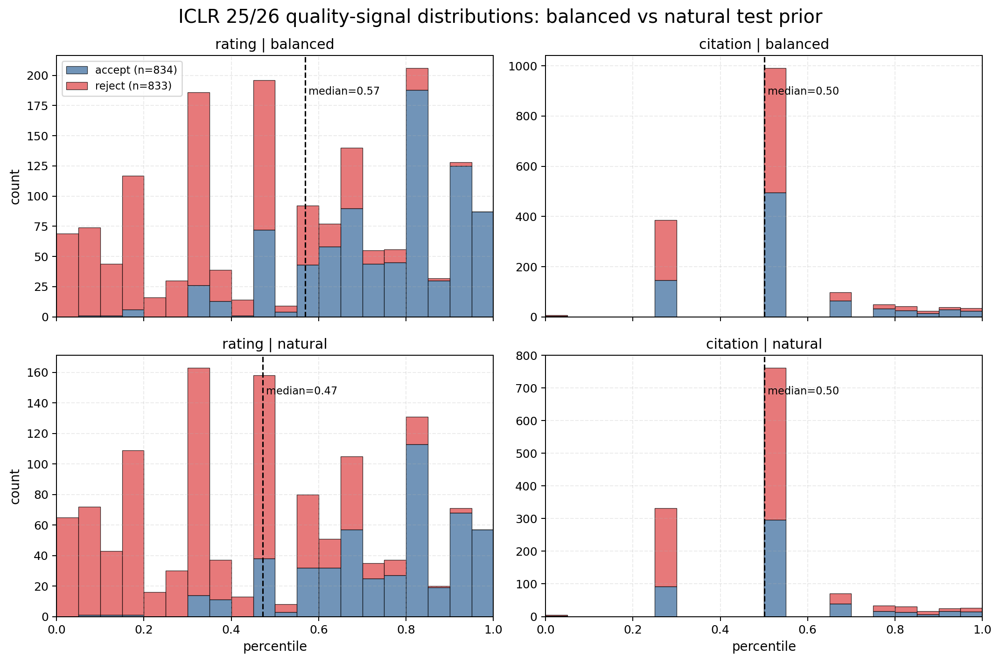

# Objective Analysis: Quality Indicator vs Conference Acceptor

This report is generated directly from repository eval files. No metric values are interpolated or fabricated.

## Scope And Availability

- Main recommendation set: 7B ICLR-trained models with the full `text/vision × {50/50, 30/70}` cross-eval grid. These are the only runs that let us compare modality and train ratio on both balanced test sets.
- 7B checkpoint rule applied: second checkpoint only. That is `ckpt-1322` for text and `ckpt-2648` / `ckpt-2642` for vision. Paths are listed in the appendix.
- 3B checkpoint rule applied: last checkpoint only. Direct ICLR-balanced text and vision results exist, but matching 3B vision arxiv cross-eval files do not. I therefore use 3B only as partial supporting evidence, not for the main cross-dataset modality recommendation.
- Field caveat: the repo does not expose exact `rating_rank_per_year` or `cite_rank_per_year` keys on these eval datasets. The rank-equivalent fields actually present are `pct_rating` and `citation_normalized_by_year` on ICLR, plus sparse `pct_rating` / `pct_citation` on arxiv.

## 1. Metrics

### Why Balanced Accuracy Over Raw Accuracy

Raw accuracy is easy to game on reject-heavy test populations. The strongest failure mode in this repo is the 7B text 30/70 model on arxiv-natural: raw accuracy looks deployment-strong at `76.3`, but accept recall is `0.0`, reject recall is `100.0`, and balanced accuracy is `50.1`, i.e. random on the balanced metric.

| Dataset | Model | Raw Acc (natural) | Accept Recall | Reject Recall | Balanced Acc | Source |
|---|---:|---:|---:|---:|---:|---|
| iclr | 7B text 50/50 | 65.6 | 59.5 | 68.4 | 63.9 | `results/final_sweep_v7_datasweepv3/optim_search_2026/ratio_crossval_clean/bz32_lr1e-6_text/test_30_70/finetuned-ckpt-1322.jsonl` |
| iclr | 7B text 30/70 | 73.7 | 42.1 | 88.1 | 65.1 | `results/final_sweep_v7_datasweepv3/optim_search_2026/ratio_sweep/bz32_lr1e-6_text_30_70/30_70/finetuned-ckpt-1322.jsonl` |
| iclr | 7B vision 50/50 | 66.2 | 65.7 | 66.5 | 66.1 | `results/final_sweep_v7_datasweepv3/optim_search_2026/ratio_crossval_clean/bz16_lr1e-6_vision/test_30_70/finetuned-ckpt-2648.jsonl` |
| iclr | 7B vision 30/70 | 73.9 | 56.7 | 81.7 | 69.2 | `results/final_sweep_v7_datasweepv3/optim_search_2026/ratio_sweep/bz16_lr1e-6_vision_30_70/30_70/finetuned-ckpt-2642.jsonl` |
| arxiv | 7B text 50/50 | 76.7 | 25.0 | 92.8 | 58.9 | `results/cross_conference_arxiv_natrate_y24up/bz32_lr1e-6_text/arxiv_eval/finetuned-ckpt-1322.jsonl` |
| arxiv | 7B text 30/70 | 76.3 | 0.3 | 100.0 | 50.1 | `results/cross_conference_arxiv_natrate_y24up/bz32_lr1e-6_text_30_70/arxiv_eval/finetuned-ckpt-1322.jsonl` |
| arxiv | 7B vision 50/50 | 72.0 | 46.2 | 80.5 | 63.3 | `results/cross_conference_arxiv_natrate_y24up/bz16_lr1e-6_vision/arxiv_eval/finetuned-ckpt-2648.jsonl` |
| arxiv | 7B vision 30/70 | 70.0 | 48.6 | 77.0 | 62.8 | `results/cross_conference_arxiv_natrate_y24up/bz16_lr1e-6_vision_30_70/arxiv_eval/finetuned-ckpt-2642.jsonl` |

The metric failure is cross-modal and cross-dataset, not a single outlier. On natural ICLR, the 30/70 models also inflate raw accuracy relative to their balanced accuracy (`73.7` vs `65.1` for text, `73.9` vs `69.2` for vision). On natural arxiv the gap is even larger for text 30/70 (`76.3` vs `50.1`).

### Thresholding / Calibration

The existing validation thresholds maximize raw accuracy, not balanced accuracy. That objective helps the reject-biased text model much more on balanced tests, but it often hurts balanced accuracy on natural tests because the threshold shifts further toward reject.

| Dataset | Model | Δ Raw Acc on balanced test | Δ Balanced Acc on balanced test | Δ Raw Acc on natural test | Δ Balanced Acc on natural test |
|---|---:|---:|---:|---:|---:|
| iclr | 7B text 50/50 | +0.9 | +0.9 | +3.1 | -5.3 |
| iclr | 7B text 30/70 | +5.6 | +5.6 | -0.3 | -3.0 |
| iclr | 7B vision 50/50 | -0.1 | -0.1 | +3.8 | -6.2 |
| iclr | 7B vision 30/70 | +0.6 | +0.6 | -0.7 | -8.6 |
| arxiv | 7B text 50/50 | +6.6 | +8.0 | -0.6 | -0.6 |
| arxiv | 7B text 30/70 | +13.1 | +15.2 | -0.1 | +7.5 |
| arxiv | 7B vision 50/50 | +2.5 | +3.2 | +1.1 | -8.4 |
| arxiv | 7B vision 30/70 | +1.1 | +1.9 | +4.0 | -7.6 |

The most important pattern is the reject-biased text model on balanced tests: text 30/70 gains `+5.6` raw-accuracy points on ICLR-balanced and `+13.1` on arxiv-balanced, versus `+0.9` and `+6.7` for text 50/50. That is exactly why raw accuracy is a bad primary metric here: thresholding can partially hide reject bias. For Objective 2 I therefore compare uncalibrated balanced-test metrics by default.

### Deriving Natural Accuracy From Balanced-Test Recalls

Balanced accuracy alone is not enough to recover natural accuracy. The quantity that is prior-invariant and sufficient is the pair of per-class recalls. Given prior `π = P(accept)`, the natural-prior raw accuracy is:

```text
raw_acc(π) = π * accept_recall + (1 - π) * reject_recall
```

For the actual natural-test priors in this repo, `π_iclr = 0.3130` and `π_arxiv = 0.2376`.

| Dataset | Model | Accept Recall on balanced test | Reject Recall on balanced test | Predicted natural raw acc | Empirical natural raw acc | Error |
|---|---:|---:|---:|---:|---:|---:|
| iclr | 7B text 50/50 | 56.2 | 74.2 | 68.6 | 65.6 | -3.0 |
| iclr | 7B text 30/70 | 39.7 | 83.4 | 69.7 | 73.7 | +4.0 |
| iclr | 7B vision 50/50 | 65.4 | 69.8 | 68.4 | 66.2 | -2.2 |
| iclr | 7B vision 30/70 | 55.0 | 74.9 | 68.6 | 73.9 | +5.3 |
| arxiv | 7B text 50/50 | 24.0 | 92.9 | 76.5 | 76.7 | +0.2 |
| arxiv | 7B text 30/70 | 0.3 | 100.0 | 76.3 | 76.3 | +0.0 |
| arxiv | 7B vision 50/50 | 45.1 | 80.4 | 72.0 | 72.0 | -0.0 |
| arxiv | 7B vision 30/70 | 48.0 | 76.2 | 69.5 | 70.0 | +0.5 |

Empirically the estimate is tight on arxiv (`0.0` to `0.5` points of error), where the balanced and natural sets are both drawn from the y24up pool. On ICLR the residual is larger (`2.2` to `5.3` points) because the balanced and natural files are different year/sample draws, not because the formula is wrong.

### Metrics Invariant To Prior Distribution

- Balanced accuracy is prior-invariant because it averages per-class recall.
- Accept recall and reject recall are themselves prior-invariant diagnostics.
- AUC is prior-invariant and threshold-free.
- Raw accuracy is not prior-invariant.

## 2. Metrics For Objective 1 (General Quality Indicator)

I interpret the requested AUC bullet as a prior-invariance point: AUC is invariant to the evaluation prior, but not to the model itself. Changing the training ratio changes the model, so AUC values still change across rows and remain informative.

For the rank-based quality metrics, the data constraint matters:
- ICLR balanced and natural sets provide full `pct_rating` and full `citation_normalized_by_year` coverage after the 2025/2026 filter.
- Arxiv y24up balanced provides only sparse quality annotations: `n=292` for `pct_rating` and `n=341` for `pct_citation` out of `1415` papers. Arxiv natural is similarly sparse. These are subset metrics, not corpus-wide metrics.

### Why Rank Correlations Are Not Prior-Invariant

The sensitivity is driven by the evaluation mixture, not by the training ratio itself. Rebalancing accept/reject changes the marginal quality-signal distribution, so overall Spearman correlations can move even when the model and the per-class quality distributions stay fixed.



The figure above uses the actual ICLR 25/26 metadata fields. `pct_rating` shifts strongly at the all-population level when moving from balanced to natural because accepts are concentrated at much higher percentiles (`median_accept=0.805`, `median_reject=0.304`). Citation percentile is less class-separable in this data, so its mixture shift is much smaller.

| Prior | Rating accept rate | Rating median all | Rating median accept | Rating median reject | Citation median all | Citation median accept | Citation median reject |
|---|---:|---:|---:|---:|---:|---:|---:|
| balanced | 50.0 | 0.569 | 0.805 | 0.304 | 0.500 | 0.500 | 0.500 |
| natural | 38.4 | 0.472 | 0.805 | 0.304 | 0.500 | 0.500 | 0.500 |

Because of that mixture sensitivity, I report both overall and per-class Spearman correlations whenever the quality field exists.

### Objective 1 Results On Balanced Test Sets (7B full grid)

#### ICLR 25/26 balanced

| Model | AUC | ρ rating overall | ρ rating accept | ρ rating reject | ρ citation overall | ρ citation accept | ρ citation reject | Source |
|---|---:|---:|---:|---:|---:|---:|---:|---|
| 7B text 50/50 | 0.721 | +0.471 | +0.207 | +0.445 | +0.203 | +0.140 | +0.162 | `results/final_sweep_v7_datasweepv3/optim_search_2026/bz32_lr1e-6_text/finetuned-ckpt-1322.jsonl` |
| 7B text 30/70 | 0.720 | +0.469 | +0.175 | +0.453 | +0.206 | +0.130 | +0.178 | `results/final_sweep_v7_datasweepv3/optim_search_2026/ratio_sweep/bz32_lr1e-6_text_30_70/balanced/finetuned-ckpt-1322.jsonl` |
| 7B vision 50/50 | 0.736 | +0.478 | +0.156 | +0.450 | +0.171 | +0.101 | +0.126 | `results/final_sweep_v7_datasweepv3/optim_search_2026/bz16_lr1e-6_vision/finetuned-ckpt-2648.jsonl` |
| 7B vision 30/70 | 0.723 | +0.472 | +0.173 | +0.457 | +0.189 | +0.121 | +0.146 | `results/final_sweep_v7_datasweepv3/optim_search_2026/ratio_sweep/bz16_lr1e-6_vision_30_70/balanced/finetuned-ckpt-2642.jsonl` |

#### Arxiv y24up balanced

These correlations are subset-only because the quality fields are sparse in the arxiv metadata (`n_rating=292`, `n_citation=341`).

| Model | AUC | ρ rating overall | ρ rating accept | ρ rating reject | ρ citation overall | ρ citation accept | ρ citation reject | Source |
|---|---:|---:|---:|---:|---:|---:|---:|---|
| 7B text 50/50 | 0.720 | +0.232 | +0.147 | +0.324 | +0.111 | +0.096 | +0.204 | `results/cross_conference_arxiv_y24up/bz32_lr1e-6_text/arxiv_eval/finetuned-ckpt-1322.jsonl` |
| 7B text 30/70 | 0.697 | +0.180 | +0.105 | +0.153 | +0.179 | +0.164 | +0.309 | `results/cross_conference_arxiv_y24up/bz32_lr1e-6_text_30_70/arxiv_eval/finetuned-ckpt-1322.jsonl` |
| 7B vision 50/50 | 0.724 | +0.166 | +0.076 | +0.359 | +0.189 | +0.167 | +0.483 | `results/cross_conference_arxiv_y24up/bz16_lr1e-6_vision/arxiv_eval/finetuned-ckpt-2648.jsonl` |
| 7B vision 30/70 | 0.704 | +0.138 | +0.016 | +0.391 | +0.215 | +0.193 | +0.620 | `results/cross_conference_arxiv_y24up/bz16_lr1e-6_vision_30_70/arxiv_eval/finetuned-ckpt-2642.jsonl` |

### Bootstrap CI Note

For natural-prior deployment reporting, the right uncertainty estimate is a bootstrap over the natural distribution (or an equivalent reweighted balanced sample). I report example 95% bootstrap CIs below for the recommended Objective 1 candidate, 7B vision 50/50.

| Dataset | Metric | n | Point estimate | 95% bootstrap CI |
|---|---:|---:|---:|---:|
| ICLR balanced | rating | 1670 | +0.478 | [+0.439, +0.513] |
| ICLR balanced | citation | 1670 | +0.171 | [+0.124, +0.219] |
| arxiv balanced | rating | 292 | +0.166 | [+0.046, +0.274] |
| arxiv balanced | citation | 341 | +0.189 | [+0.079, +0.288] |

The CI width itself is informative: the ICLR rating signal is tight because coverage is full, whereas arxiv subset CIs are much wider because the annotated subset is small and venue-skewed.

## 3. Metrics For Objective 2 (Accurate Conference Acceptor)

Objective 2 uses balanced-test balanced accuracy, accept recall, and reject recall. I use the raw threshold (`τ=0`) for the main comparison because the stored calibration thresholds optimize raw accuracy, not balanced accuracy.

| Dataset | Model | Balanced Acc | Accept Recall | Reject Recall | AUC | Source |
|---|---:|---:|---:|---:|---:|---|
| iclr | 7B text 50/50 | 65.2 | 56.2 | 74.2 | 0.721 | `results/final_sweep_v7_datasweepv3/optim_search_2026/bz32_lr1e-6_text/finetuned-ckpt-1322.jsonl` |
| iclr | 7B text 30/70 | 61.6 | 39.7 | 83.4 | 0.720 | `results/final_sweep_v7_datasweepv3/optim_search_2026/ratio_sweep/bz32_lr1e-6_text_30_70/balanced/finetuned-ckpt-1322.jsonl` |
| iclr | 7B vision 50/50 | 67.6 | 65.4 | 69.8 | 0.736 | `results/final_sweep_v7_datasweepv3/optim_search_2026/bz16_lr1e-6_vision/finetuned-ckpt-2648.jsonl` |
| iclr | 7B vision 30/70 | 64.9 | 55.0 | 74.9 | 0.723 | `results/final_sweep_v7_datasweepv3/optim_search_2026/ratio_sweep/bz16_lr1e-6_vision_30_70/balanced/finetuned-ckpt-2642.jsonl` |
| arxiv | 7B text 50/50 | 58.4 | 24.0 | 92.9 | 0.720 | `results/cross_conference_arxiv_y24up/bz32_lr1e-6_text/arxiv_eval/finetuned-ckpt-1322.jsonl` |
| arxiv | 7B text 30/70 | 50.1 | 0.3 | 100.0 | 0.697 | `results/cross_conference_arxiv_y24up/bz32_lr1e-6_text_30_70/arxiv_eval/finetuned-ckpt-1322.jsonl` |
| arxiv | 7B vision 50/50 | 62.8 | 45.1 | 80.4 | 0.724 | `results/cross_conference_arxiv_y24up/bz16_lr1e-6_vision/arxiv_eval/finetuned-ckpt-2648.jsonl` |
| arxiv | 7B vision 30/70 | 62.1 | 48.0 | 76.2 | 0.704 | `results/cross_conference_arxiv_y24up/bz16_lr1e-6_vision_30_70/arxiv_eval/finetuned-ckpt-2642.jsonl` |

## 4. Comprehensive Analysis: Arxiv y24up + ICLR 25/26 (Balanced Test Sets)

### Which modality is optimal?

- **Objective 1:** the best-supported choice is **7B vision 50/50**. It has the top AUC on both balanced test sets (`0.736` on ICLR, `0.724` on arxiv), the top ICLR rating-rank correlation (`+0.478`), and competitive citation/rating subset performance on arxiv. Arxiv quality rankings are sparse and split across metrics, so I do not let the small subset overturn the full-coverage ICLR signal.
- **Objective 2:** **7B vision 50/50** is also the clean winner. It has the best balanced accuracy on both balanced test sets: `67.6` on ICLR balanced and `62.8` on arxiv balanced.

### Which train ratio is optimal?

- **Objective 1:** on the complete 7B grid, `50/50` is the safer ratio overall. It wins AUC on both balanced tests for both modalities, and the strongest rating-signal row is 7B vision 50/50 on ICLR.
- **Objective 2:** `50/50` is again the best-supported ratio. On the winning modality it outperforms the 30/70 counterpart on both balanced tests (`67.6` vs `64.9` on ICLR, `62.8` vs `62.1` on arxiv).

### Recommended configurations

| Objective | Recommended configuration | Why |
|---|---|---|
| Objective 1 — General Quality Indicator | **7B vision 50/50, no threshold calibration** | strongest full-coverage ICLR quality correlation, best AUC on both balanced tests, and competitive arxiv subset correlations |
| Objective 2 — Accurate Conference Acceptor | **7B vision 50/50, evaluate with balanced accuracy on balanced test sets** | best balanced accuracy on both balanced test sets and the most balanced per-class recalls |

### 3B partial evidence

The direct ICLR-balanced 3B runs point in the same modality direction, but they are incomplete for cross-dataset recommendation because no matching 3B vision arxiv-balanced eval file exists.

| Model | Dataset coverage | Balanced Acc | AUC | ρ rating overall | ρ citation overall | Source |
|---|---|---:|---:|---:|---:|---|
| 3B text (ICLR balanced only) | ICLR 25/26 balanced only | 66.2 | 0.719 | +0.444 | +0.196 | `results/final_sweep_v7_datasweepv3/optim_search_2026/scaling/bz32_lr1e-6_text_3b/finetuned-ckpt-2644.jsonl` |
| 3B vision (ICLR balanced only) | ICLR 25/26 balanced only | 66.7 | 0.728 | +0.465 | +0.181 | `results/final_sweep_v7_datasweepv3/optim_search_2026/scaling/bz16_lr1e-6_vision_3b/finetuned-ckpt-5296.jsonl` |

Text-only 3B cross-eval files do exist:
- `results/final_sweep_v7_datasweepv3/optim_search_2026/scaling/bz32_lr1e-6_text_3b/8eval/iclr_balanced_test/finetuned-ckpt-2644.jsonl`
- `results/final_sweep_v7_datasweepv3/optim_search_2026/scaling/bz32_lr1e-6_text_3b/8eval/arxiv_balanced_test/finetuned-ckpt-2644.jsonl`
- `results/final_sweep_v7_datasweepv3/final_data_sweep_v3/arxiv_train/small_sachin/arxiv_21k_text_3b/iclr_balanced_test/finetuned-ckpt-2624.jsonl`
- `results/final_sweep_v7_datasweepv3/final_data_sweep_v3/arxiv_train/small_sachin/arxiv_21k_text_3b/arxiv_balanced_test/finetuned-ckpt-2624.jsonl`
- `results/final_sweep_v7_datasweepv3/final_data_sweep_v3/arxiv_train/natrate_sachin/arxiv_natrate_21k_text_3b/iclr_balanced_test/finetuned-ckpt-2624.jsonl`
- `results/final_sweep_v7_datasweepv3/final_data_sweep_v3/arxiv_train/natrate_sachin/arxiv_natrate_21k_text_3b/arxiv_balanced_test/finetuned-ckpt-2624.jsonl`
But because there is no corresponding 3B vision arxiv-balanced cross-eval, I treat those as supplementary text-only evidence rather than using them to choose modality.

## Appendix: 7B Source Paths

### 7B text 50/50
- `iclr_balanced_test`: `results/final_sweep_v7_datasweepv3/optim_search_2026/bz32_lr1e-6_text/finetuned-ckpt-1322.jsonl`
- `iclr_natural_test`: `results/final_sweep_v7_datasweepv3/optim_search_2026/ratio_crossval_clean/bz32_lr1e-6_text/test_30_70/finetuned-ckpt-1322.jsonl`
- `arxiv_balanced_test`: `results/cross_conference_arxiv_y24up/bz32_lr1e-6_text/arxiv_eval/finetuned-ckpt-1322.jsonl`
- `arxiv_natural_test`: `results/cross_conference_arxiv_natrate_y24up/bz32_lr1e-6_text/arxiv_eval/finetuned-ckpt-1322.jsonl`
- `iclr_balanced_val`: `results/iclr_val_calib/bz32_lr1e-6_text/val_balanced/finetuned-ckpt-1322.jsonl`
- `iclr_natural_val`: `results/iclr_val_calib/bz32_lr1e-6_text/val_30_70/finetuned-ckpt-1322.jsonl`
- `arxiv_balanced_val`: `results/cross_conference_arxiv_y24up/bz32_lr1e-6_text/arxiv_val/finetuned-ckpt-1322.jsonl`
- `arxiv_natural_val`: `results/cross_conference_arxiv_natrate_y24up/bz32_lr1e-6_text/arxiv_val/finetuned-ckpt-1322.jsonl`

### 7B text 30/70
- `iclr_balanced_test`: `results/final_sweep_v7_datasweepv3/optim_search_2026/ratio_sweep/bz32_lr1e-6_text_30_70/balanced/finetuned-ckpt-1322.jsonl`
- `iclr_natural_test`: `results/final_sweep_v7_datasweepv3/optim_search_2026/ratio_sweep/bz32_lr1e-6_text_30_70/30_70/finetuned-ckpt-1322.jsonl`
- `arxiv_balanced_test`: `results/cross_conference_arxiv_y24up/bz32_lr1e-6_text_30_70/arxiv_eval/finetuned-ckpt-1322.jsonl`
- `arxiv_natural_test`: `results/cross_conference_arxiv_natrate_y24up/bz32_lr1e-6_text_30_70/arxiv_eval/finetuned-ckpt-1322.jsonl`
- `iclr_balanced_val`: `results/iclr_val_calib/bz32_lr1e-6_text_30_70/val_balanced/finetuned-ckpt-1322.jsonl`
- `iclr_natural_val`: `results/iclr_val_calib/bz32_lr1e-6_text_30_70/val_30_70/finetuned-ckpt-1322.jsonl`
- `arxiv_balanced_val`: `results/cross_conference_arxiv_y24up/bz32_lr1e-6_text_30_70/arxiv_val/finetuned-ckpt-1322.jsonl`
- `arxiv_natural_val`: `results/cross_conference_arxiv_natrate_y24up/bz32_lr1e-6_text_30_70/arxiv_val/finetuned-ckpt-1322.jsonl`

### 7B vision 50/50
- `iclr_balanced_test`: `results/final_sweep_v7_datasweepv3/optim_search_2026/bz16_lr1e-6_vision/finetuned-ckpt-2648.jsonl`
- `iclr_natural_test`: `results/final_sweep_v7_datasweepv3/optim_search_2026/ratio_crossval_clean/bz16_lr1e-6_vision/test_30_70/finetuned-ckpt-2648.jsonl`
- `arxiv_balanced_test`: `results/cross_conference_arxiv_y24up/bz16_lr1e-6_vision/arxiv_eval/finetuned-ckpt-2648.jsonl`
- `arxiv_natural_test`: `results/cross_conference_arxiv_natrate_y24up/bz16_lr1e-6_vision/arxiv_eval/finetuned-ckpt-2648.jsonl`
- `iclr_balanced_val`: `results/final_sweep_v7_datasweepv3/optim_search_2026/bz16_lr1e-6_vision/validation-ckpt-2648.jsonl`
- `iclr_natural_val`: `results/iclr_val_calib/bz16_lr1e-6_vision/val_30_70/finetuned-ckpt-2648.jsonl`
- `arxiv_balanced_val`: `results/cross_conference_arxiv_y24up/bz16_lr1e-6_vision/arxiv_val/finetuned-ckpt-2648.jsonl`
- `arxiv_natural_val`: `results/cross_conference_arxiv_natrate_y24up/bz16_lr1e-6_vision/arxiv_val/finetuned-ckpt-2648.jsonl`

### 7B vision 30/70
- `iclr_balanced_test`: `results/final_sweep_v7_datasweepv3/optim_search_2026/ratio_sweep/bz16_lr1e-6_vision_30_70/balanced/finetuned-ckpt-2642.jsonl`
- `iclr_natural_test`: `results/final_sweep_v7_datasweepv3/optim_search_2026/ratio_sweep/bz16_lr1e-6_vision_30_70/30_70/finetuned-ckpt-2642.jsonl`
- `arxiv_balanced_test`: `results/cross_conference_arxiv_y24up/bz16_lr1e-6_vision_30_70/arxiv_eval/finetuned-ckpt-2642.jsonl`
- `arxiv_natural_test`: `results/cross_conference_arxiv_natrate_y24up/bz16_lr1e-6_vision_30_70/arxiv_eval/finetuned-ckpt-2642.jsonl`
- `iclr_balanced_val`: `results/iclr_val_calib/bz16_lr1e-6_vision_30_70/val_balanced/finetuned-ckpt-2642.jsonl`
- `iclr_natural_val`: `results/iclr_val_calib/bz16_lr1e-6_vision_30_70/val_30_70/finetuned-ckpt-2642.jsonl`
- `arxiv_balanced_val`: `results/cross_conference_arxiv_y24up/bz16_lr1e-6_vision_30_70/arxiv_val/finetuned-ckpt-2642.jsonl`
- `arxiv_natural_val`: `results/cross_conference_arxiv_natrate_y24up/bz16_lr1e-6_vision_30_70/arxiv_val/finetuned-ckpt-2642.jsonl`
