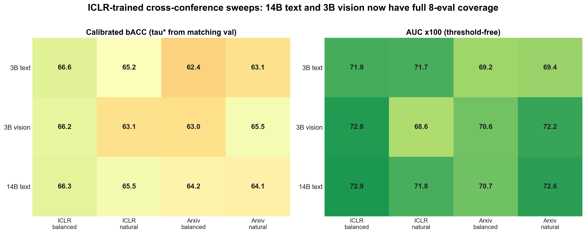
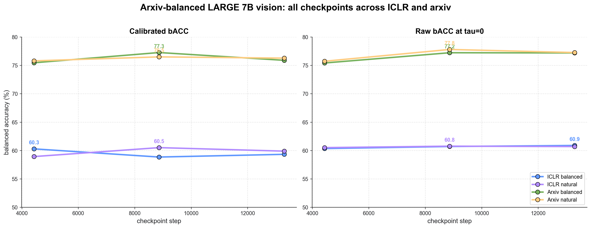

# Latest Results Update: Cross-Conference Scaling and Large Arxiv Vision

Generated by `scripts/generate_neurips26_latest_results.py`.

## Headline takeaways

- **ICLR-trained 3B vision cross-eval is now complete.** It is competitive with 3B text on ICLR and stronger on arxiv-natural, so the vision story is not only a 7B artifact.
- **ICLR-trained 14B text cross-eval is now complete.** Scaling text to 14B improves arxiv transfer relative to 3B text, but it still does not erase the central distribution issue: in-domain ICLR and arxiv deployment behave differently.
- **Large arxiv-balanced 7B vision is complete through ckpt 13293.** Best calibrated arxiv-balanced bACC is **77.3** at ckpt 8862; best ICLR-balanced bACC is **60.3** at ckpt 4431.
- **The large arxiv vision run strengthens the training-distribution story.** It is the right candidate for arxiv deployment, but the ICLR cells still need to be reported as OOD, not as a universal replacement for ICLR-trained PaperLens.

## Figures

## ICLR-trained cross-conference 8-eval sweep

Calibration: `tau*` is learned on the matching validation cell by maximizing balanced accuracy, then applied to the corresponding test cell. AUC is unchanged by thresholding.

| model | ckpt | dataset | prior | n | bACC raw | bACC tau* | AUC | AccR/RejR tau* | tau* |
|---|---:|---|---|---:|---:|---:|---:|---:|---:|
| ICLR 3B text | 2644 | iclr | balanced | 1667 | 66.2 | 66.6 | 0.719 | 73/60 | -0.124 |
| ICLR 3B text | 2644 | iclr | natural | 1587 | 66.0 | 65.2 | 0.717 | 75/55 | -0.124 |
| ICLR 3B text | 2644 | arxiv | balanced | 1415 | 59.9 | 62.4 | 0.692 | 57/68 | -0.874 |
| ICLR 3B text | 2644 | arxiv | natural | 1431 | 60.5 | 63.1 | 0.694 | 61/65 | -1.124 |
| ICLR 3B vision | 5296 | iclr | balanced | 1670 | 66.7 | 66.2 | 0.728 | 60/73 | +0.374 |
| ICLR 3B vision | 5296 | iclr | natural | 1594 | 63.7 | 63.1 | 0.686 | 60/66 | +0.374 |
| ICLR 3B vision | 5296 | arxiv | balanced | 1414 | 65.2 | 63.0 | 0.706 | 85/41 | -0.624 |
| ICLR 3B vision | 5296 | arxiv | natural | 1468 | 65.0 | 65.5 | 0.722 | 70/61 | -0.001 |
| ICLR 14B text | 1322 | iclr | balanced | 1667 | 66.5 | 66.3 | 0.729 | 73/60 | -0.249 |
| ICLR 14B text | 1322 | iclr | natural | 1587 | 66.1 | 65.5 | 0.718 | 72/59 | -0.124 |
| ICLR 14B text | 1322 | arxiv | balanced | 1415 | 57.9 | 64.2 | 0.707 | 68/60 | -1.124 |
| ICLR 14B text | 1322 | arxiv | natural | 1431 | 58.4 | 64.1 | 0.726 | 85/44 | -1.873 |

## Large arxiv-balanced 7B vision checkpoint sweep

| model | ckpt | dataset | prior | n | bACC raw | bACC tau* | AUC | AccR/RejR tau* | tau* |
|---|---:|---|---|---:|---:|---:|---:|---:|---:|
| Arxiv-large 7B vision balanced | 4431 | iclr | balanced | 1670 | 60.4 | 60.3 | 0.642 | 70/51 | -0.124 |
| Arxiv-large 7B vision balanced | 4431 | iclr | natural | 1594 | 60.5 | 58.9 | 0.643 | 74/44 | -0.249 |
| Arxiv-large 7B vision balanced | 4431 | arxiv | balanced | 1414 | 75.4 | 75.5 | 0.835 | 80/71 | -0.124 |
| Arxiv-large 7B vision balanced | 4431 | arxiv | natural | 1468 | 75.7 | 75.8 | 0.841 | 80/72 | -0.001 |
| Arxiv-large 7B vision balanced | 8862 | iclr | balanced | 1670 | 60.7 | 58.9 | 0.655 | 84/33 | -1.624 |
| Arxiv-large 7B vision balanced | 8862 | iclr | natural | 1594 | 60.8 | 60.5 | 0.648 | 65/56 | -0.500 |
| Arxiv-large 7B vision balanced | 8862 | arxiv | balanced | 1414 | 77.2 | 77.3 | 0.851 | 80/74 | -0.499 |
| Arxiv-large 7B vision balanced | 8862 | arxiv | natural | 1468 | 77.8 | 76.5 | 0.855 | 84/69 | -0.750 |
| Arxiv-large 7B vision balanced | 13293 | iclr | balanced | 1670 | 60.9 | 59.3 | 0.656 | 82/36 | -1.874 |
| Arxiv-large 7B vision balanced | 13293 | iclr | natural | 1594 | 60.7 | 59.9 | 0.648 | 77/43 | -1.500 |
| Arxiv-large 7B vision balanced | 13293 | arxiv | balanced | 1414 | 77.2 | 75.9 | 0.850 | 84/67 | -0.999 |
| Arxiv-large 7B vision balanced | 13293 | arxiv | natural | 1468 | 77.3 | 76.3 | 0.853 | 85/68 | -0.875 |

## Best large-vision operating points

| eval cell | best ckpt | bACC tau* | bACC raw | AUC | AccR/RejR tau* |
|---|---:|---:|---:|---:|---:|
| arxiv balanced | 8862 | 77.3 | 77.2 | 0.851 | 80/74 |
| arxiv natural | 8862 | 76.5 | 77.8 | 0.855 | 84/69 |
| ICLR balanced | 4431 | 60.3 | 60.4 | 0.642 | 70/51 |
| ICLR natural | 8862 | 60.5 | 60.8 | 0.648 | 65/56 |

## Paper integration

- Add a model-size/cross-conference subsection with the 3B vision and 14B text rows. This lets us separate **modality** from **parameter count**.
- Update the arxiv-trained distribution subsection: large arxiv-balanced vision is no longer pending, and should be treated as the main arxiv-deployment candidate if its best checkpoint survives common-subset comparisons.
- Keep reporting ICLR and arxiv cells separately. The new results strengthen, rather than weaken, the claim that training distribution dominates the deployment recommendation.