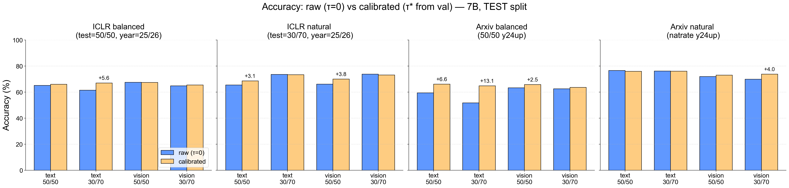
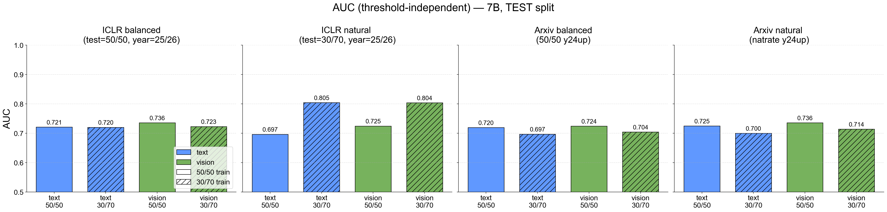
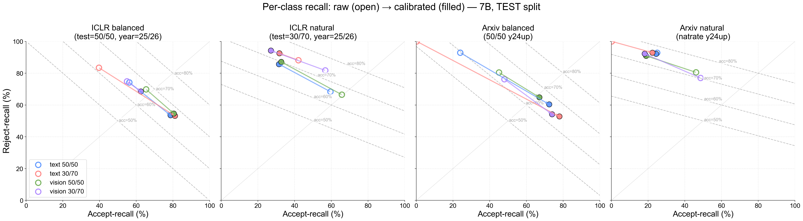
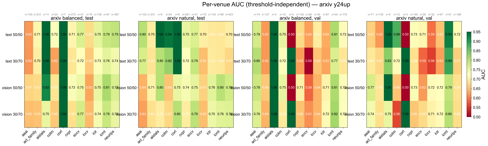
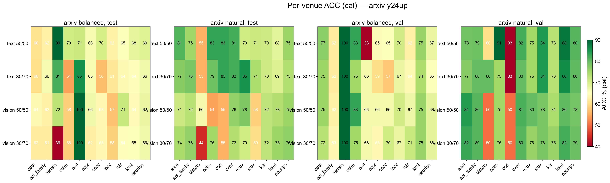
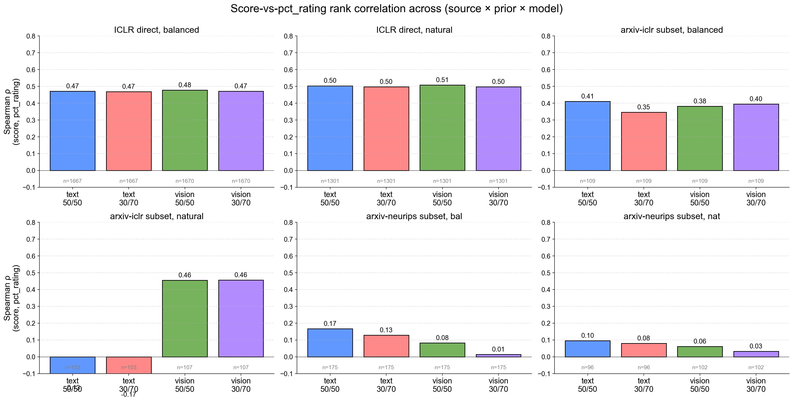
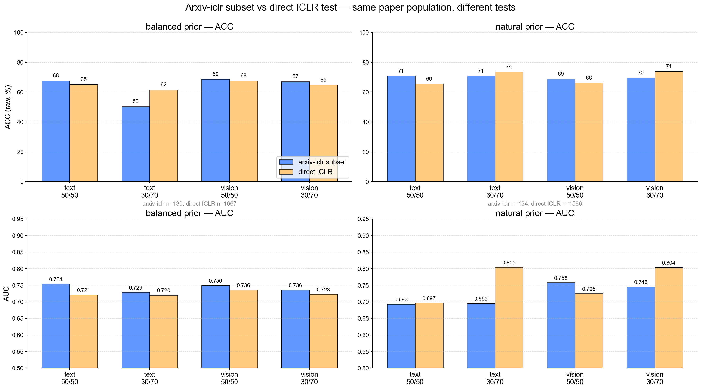
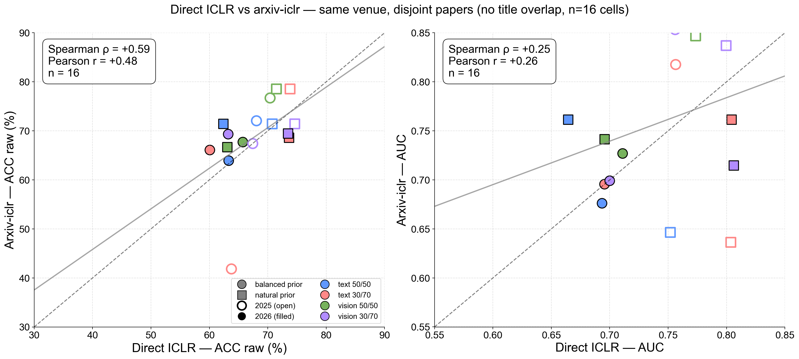
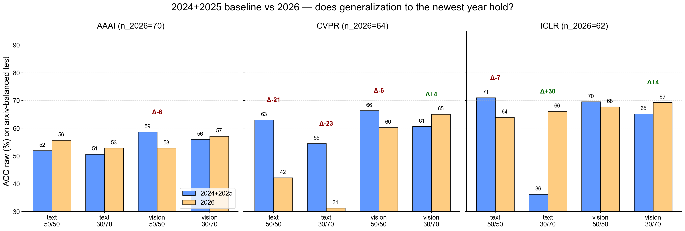
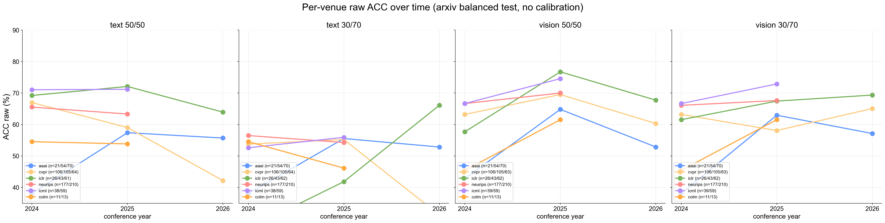

# 7B Ratio Cross-Eval — Consolidated Report

**Scope:** 4 model configs (text/vision × 50/50/30/70 train) × ICLR + arxiv × balanced/natural test priors × test+val splits.

- ICLR test+val are filtered to year ∈ {2025, 2026}.
- Arxiv test+val are y24up (conference_year ≥ 2024).
- For ICLR "natural" prior: test ratio = 30/70 (matches ICLR's ~30% accept rate).
- For arxiv "natural" prior: per-conference natural acceptance rates (natrate; openaccept.org 5-year averages).
- Score: log-odds = lp_accept[k] - lp_reject[k] at the decision step.
- Calibration: τ* learned on val.
  - ICLR: single τ* per (modality, train, test_prior) cell.
  - Arxiv: per-(modality, train, eval_set, venue) τ* (sparse venues, val n<10, fall back to model-global τ*).

## Headline

- **AUC**: vision 50/50 is the most *consistent* recipe (≈0.72-0.74 across all 4 test cells). On the matched-prior ICLR-natural (test=30/70) cell, *30/70-trained* models hit a much higher AUC (~0.80) for both modalities — suggests test-population drift between the balanced and 30/70 ICLR test sets, not just a prior difference.
- **ACC** (depends on test prior): on natural-prior tests (ICLR 30/70, arxiv natrate), the matched-prior train recipe wins raw. On balanced tests, calibration converges all 4 (modality × ratio) cells to a tighter 64-68% band.
- **Reject-recall** is the diagnostic for bias: 30/70-trained models on balanced tests have extreme reject-recall (~80-100%) at τ=0; calibration trades reject-recall for accept-recall to recover ACC — the biggest single calibration lift is **text 30/70 on arxiv balanced: +13.1pp**.

## Figures

## Metrics — TEST split

### ICLR balanced (test=50/50, year=25/26)

| model | n | ACC raw | ACC cal | AUC | AccR raw / RejR raw | AccR cal / RejR cal |
|---|---:|---:|---:|---:|---:|---:|
| text 50/50 | 1667 | 65.2 | 66.1 | 0.721 | 56/74 | 79/54 |
| text 30/70 | 1667 | 61.5 | 67.1 | 0.720 | 40/83 | 81/53 |
| vision 50/50 | 1670 | 67.6 | 67.5 | 0.736 | 65/70 | 80/55 |
| vision 30/70 | 1670 | 64.9 | 65.5 | 0.723 | 55/75 | 63/69 |

### ICLR natural  (test=30/70, year=25/26)

| model | n | ACC raw | ACC cal | AUC | AccR raw / RejR raw | AccR cal / RejR cal |
|---|---:|---:|---:|---:|---:|---:|
| text 50/50 | 1586 | 65.6 | 68.7 | 0.697 | 60/68 | 31/86 |
| text 30/70 | 1594 | 73.7 | 73.5 | 0.805 | 42/88 | 32/93 |
| vision 50/50 | 1594 | 66.2 | 70.1 | 0.725 | 66/66 | 33/87 |
| vision 30/70 | 1594 | 73.9 | 73.2 | 0.804 | 57/82 | 27/94 |

### Arxiv balanced (50/50 y24up)

| model | n | ACC raw | ACC cal | AUC | AccR raw / RejR raw | AccR cal / RejR cal |
|---|---:|---:|---:|---:|---:|---:|
| text 50/50 | 1414 | 59.5 | 66.2 | 0.720 | 24/93 | 72/60 |
| text 30/70 | 1415 | 51.8 | 64.9 | 0.697 | 0/100 | 78/53 |
| vision 50/50 | 1414 | 63.4 | 65.9 | 0.724 | 45/80 | 67/65 |
| vision 30/70 | 1414 | 62.6 | 63.7 | 0.704 | 48/76 | 74/54 |

### Arxiv natural  (natrate y24up)

| model | n | ACC raw | ACC cal | AUC | AccR raw / RejR raw | AccR cal / RejR cal |
|---|---:|---:|---:|---:|---:|---:|
| text 50/50 | 1430 | 76.7 | 76.1 | 0.725 | 25/93 | 24/92 |
| text 30/70 | 1431 | 76.3 | 76.2 | 0.700 | 0/100 | 22/93 |
| vision 50/50 | 1468 | 72.0 | 73.1 | 0.736 | 46/81 | 19/91 |
| vision 30/70 | 1468 | 70.0 | 73.9 | 0.714 | 49/77 | 18/92 |

## Metrics — VAL split

### ICLR balanced (test=50/50, year=25/26)

| model | n | ACC raw | ACC cal | AUC | AccR raw / RejR raw | AccR cal / RejR cal |
|---|---:|---:|---:|---:|---:|---:|
| text 50/50 | 844 | 64.9 | 66.2 | 0.717 | 56/74 | 80/53 |
| text 30/70 | 844 | 62.6 | 65.8 | 0.712 | 42/83 | 78/54 |
| vision 50/50 | 845 | 65.1 | 65.9 | 0.721 | 63/67 | 78/54 |
| vision 30/70 | 845 | 66.6 | 67.8 | 0.720 | 56/78 | 65/71 |

### ICLR natural  (test=30/70, year=25/26)

| model | n | ACC raw | ACC cal | AUC | AccR raw / RejR raw | AccR cal / RejR cal |
|---|---:|---:|---:|---:|---:|---:|
| text 50/50 | 600 | 67.8 | 73.3 | 0.715 | 53/74 | 31/91 |
| text 30/70 | 600 | 70.5 | 72.2 | 0.702 | 40/83 | 30/90 |
| vision 50/50 | 606 | 68.0 | 73.9 | 0.749 | 69/67 | 37/90 |
| vision 30/70 | 606 | 71.0 | 73.3 | 0.738 | 56/78 | 28/93 |

### Arxiv balanced (50/50 y24up)

| model | n | ACC raw | ACC cal | AUC | AccR raw / RejR raw | AccR cal / RejR cal |
|---|---:|---:|---:|---:|---:|---:|
| text 50/50 | 722 | 57.1 | 67.7 | 0.682 | 19/92 | 72/64 |
| text 30/70 | 722 | 52.1 | 65.5 | 0.656 | 0/100 | 76/56 |
| vision 50/50 | 719 | 63.7 | 68.7 | 0.708 | 43/82 | 70/68 |
| vision 30/70 | 719 | 62.3 | 68.3 | 0.691 | 48/75 | 77/61 |

### Arxiv natural  (natrate y24up)

| model | n | ACC raw | ACC cal | AUC | AccR raw / RejR raw | AccR cal / RejR cal |
|---|---:|---:|---:|---:|---:|---:|
| text 50/50 | 732 | 77.0 | 80.2 | 0.702 | 22/93 | 27/96 |
| text 30/70 | 732 | 77.5 | 79.4 | 0.670 | 0/100 | 22/96 |
| vision 50/50 | 729 | 73.7 | 79.7 | 0.712 | 48/81 | 26/96 |
| vision 30/70 | 729 | 69.0 | 79.7 | 0.684 | 50/75 | 25/96 |

## Thresholds used (τ*)

### ICLR (single τ* per cell, learned on val year≥2025)

| modality | train | test prior | τ* |
|---|---|---|---:|
| text | 50/50 | balanced | -0.374 |
| text | 50/50 | natural | +0.499 |
| text | 30/70 | balanced | -0.873 |
| text | 30/70 | natural | +0.249 |
| vision | 50/50 | balanced | -0.499 |
| vision | 50/50 | natural | +0.874 |
| vision | 30/70 | balanced | -0.124 |
| vision | 30/70 | natural | +0.749 |

### Arxiv (per-(modality, train, eval_set, venue) τ*; sparse venues use the model-global τ* marked `g`)

| modality | train | eval | venue | τ* | source |
|---|---|---|---|---:|:---|
| text | 50/50 | balanced | _GLOBAL_ | -1.374 | (used as fallback for sparse venues) |
| text | 50/50 | balanced | aaai | -2.249 | venue |
| text | 50/50 | balanced | acl_family | -1.249 | venue |
| text | 50/50 | balanced | aistats | -1.374 | global |
| text | 50/50 | balanced | colm | -1.374 | venue |
| text | 50/50 | balanced | corl | -1.374 | global |
| text | 50/50 | balanced | cvpr | -0.874 | venue |
| text | 50/50 | balanced | eccv | -1.249 | venue |
| text | 50/50 | balanced | iccv | -1.624 | venue |
| text | 50/50 | balanced | iclr | -0.374 | venue |
| text | 50/50 | balanced | icml | -0.624 | venue |
| text | 50/50 | balanced | neurips | -1.374 | venue |

| text | 50/50 | natural | _GLOBAL_ | +0.499 | (used as fallback for sparse venues) |
| text | 50/50 | natural | aaai | -0.001 | venue |
| text | 50/50 | natural | acl_family | -0.374 | venue |
| text | 50/50 | natural | aistats | +0.499 | global |
| text | 50/50 | natural | colm | -1.374 | venue |
| text | 50/50 | natural | corl | +0.499 | global |
| text | 50/50 | natural | cvpr | +0.499 | venue |
| text | 50/50 | natural | eccv | -0.999 | venue |
| text | 50/50 | natural | iccv | +0.499 | venue |
| text | 50/50 | natural | iclr | -0.001 | venue |
| text | 50/50 | natural | icml | -0.624 | venue |
| text | 50/50 | natural | neurips | +0.499 | venue |

| text | 30/70 | balanced | _GLOBAL_ | -4.248 | (used as fallback for sparse venues) |
| text | 30/70 | balanced | aaai | -5.744 | venue |
| text | 30/70 | balanced | acl_family | -5.246 | venue |
| text | 30/70 | balanced | aistats | -4.248 | global |
| text | 30/70 | balanced | colm | -5.744 | venue |
| text | 30/70 | balanced | corl | -4.248 | global |
| text | 30/70 | balanced | cvpr | -4.123 | venue |
| text | 30/70 | balanced | eccv | -6.119 | venue |
| text | 30/70 | balanced | iccv | -3.748 | venue |
| text | 30/70 | balanced | iclr | -1.999 | venue |
| text | 30/70 | balanced | icml | -3.622 | venue |
| text | 30/70 | balanced | neurips | -3.747 | venue |

| text | 30/70 | natural | _GLOBAL_ | -1.124 | (used as fallback for sparse venues) |
| text | 30/70 | natural | aaai | -1.624 | venue |
| text | 30/70 | natural | acl_family | -2.124 | venue |
| text | 30/70 | natural | aistats | -1.124 | global |
| text | 30/70 | natural | colm | -3.873 | venue |
| text | 30/70 | natural | corl | -1.124 | global |
| text | 30/70 | natural | cvpr | -1.249 | venue |
| text | 30/70 | natural | eccv | -0.374 | venue |
| text | 30/70 | natural | iccv | -0.999 | venue |
| text | 30/70 | natural | iclr | -1.999 | venue |
| text | 30/70 | natural | icml | -2.373 | venue |
| text | 30/70 | natural | neurips | -1.249 | venue |

| vision | 50/50 | balanced | _GLOBAL_ | -1.124 | (used as fallback for sparse venues) |
| vision | 50/50 | balanced | aaai | -1.499 | venue |
| vision | 50/50 | balanced | acl_family | -1.124 | venue |
| vision | 50/50 | balanced | aistats | -1.124 | global |
| vision | 50/50 | balanced | colm | -1.999 | venue |
| vision | 50/50 | balanced | corl | -1.124 | global |
| vision | 50/50 | balanced | cvpr | -0.625 | venue |
| vision | 50/50 | balanced | eccv | -0.375 | venue |
| vision | 50/50 | balanced | iccv | -0.250 | venue |
| vision | 50/50 | balanced | iclr | -0.124 | venue |
| vision | 50/50 | balanced | icml | -1.500 | venue |
| vision | 50/50 | balanced | neurips | +0.124 | venue |

| vision | 50/50 | natural | _GLOBAL_ | +1.124 | (used as fallback for sparse venues) |
| vision | 50/50 | natural | aaai | -0.000 | venue |
| vision | 50/50 | natural | acl_family | +0.374 | venue |
| vision | 50/50 | natural | aistats | +1.124 | global |
| vision | 50/50 | natural | colm | -1.624 | venue |
| vision | 50/50 | natural | corl | +1.124 | global |
| vision | 50/50 | natural | cvpr | +1.124 | venue |
| vision | 50/50 | natural | eccv | +0.874 | venue |
| vision | 50/50 | natural | iccv | -0.250 | venue |
| vision | 50/50 | natural | iclr | +0.874 | venue |
| vision | 50/50 | natural | icml | +0.249 | venue |
| vision | 50/50 | natural | neurips | +1.873 | venue |

| vision | 30/70 | balanced | _GLOBAL_ | -0.249 | (used as fallback for sparse venues) |
| vision | 30/70 | balanced | aaai | -0.999 | venue |
| vision | 30/70 | balanced | acl_family | -0.749 | venue |
| vision | 30/70 | balanced | aistats | -0.249 | global |
| vision | 30/70 | balanced | colm | -1.374 | venue |
| vision | 30/70 | balanced | corl | -0.249 | global |
| vision | 30/70 | balanced | cvpr | -0.125 | venue |
| vision | 30/70 | balanced | eccv | -0.375 | venue |
| vision | 30/70 | balanced | iccv | +0.250 | venue |
| vision | 30/70 | balanced | iclr | +0.249 | venue |
| vision | 30/70 | balanced | icml | -0.874 | venue |
| vision | 30/70 | balanced | neurips | -0.749 | venue |

| vision | 30/70 | natural | _GLOBAL_ | +1.249 | (used as fallback for sparse venues) |
| vision | 30/70 | natural | aaai | +0.125 | venue |
| vision | 30/70 | natural | acl_family | +0.874 | venue |
| vision | 30/70 | natural | aistats | +1.249 | global |
| vision | 30/70 | natural | colm | +0.125 | venue |
| vision | 30/70 | natural | corl | +1.249 | global |
| vision | 30/70 | natural | cvpr | +1.124 | venue |
| vision | 30/70 | natural | eccv | +0.499 | venue |
| vision | 30/70 | natural | iccv | +0.250 | venue |
| vision | 30/70 | natural | iclr | +0.749 | venue |
| vision | 30/70 | natural | icml | +0.125 | venue |
| vision | 30/70 | natural | neurips | +0.999 | venue |

## Notes / caveats

- `accept-recall` = TP / total_positives (sensitivity); `reject-recall` = TN / total_negatives (specificity).
- `ACC raw` uses τ=0 (the natural decision boundary on the log-odds score).
- For ICLR, calibrated metrics use the single τ* from val matching the test prior.
- For arxiv, calibrated metrics use the per-venue τ*, with the model-global τ* as fallback for venues with val n<10. The pooled accept/reject recalls are weighted by venue test counts.
- All numbers are 7B (Qwen2.5-7B for text, Qwen2.5-VL-7B for vision).

---

## Extended Analysis (appendix)

Appended after initial report. Adds: per-venue arxiv breakdown, y25+ ablation (drop ECCV), score↔pct_rating correlation, and arxiv-iclr-subset vs direct-ICLR comparison.

### A. Headline trends

- **Modality-divergent correlation in arxiv-natural-iclr**: on the natrate ICLR subset of arxiv test, vision 50/50 and 30/70 both reach **ρ ≈ +0.46** with `pct_rating`, but text 50/50 and 30/70 give **ρ ≈ -0.13 to -0.17** (negative!). Vision still tracks reviewer quality after the prior shift; text inverts. (n=103-107 each, so a real but moderate effect.)
- **Direct-ICLR correlation is strong and modality-invariant**: all 4 models hit **ρ = 0.47-0.51** with `pct_rating`, on both balanced and natural prior. So on the direct ICLR test set, model log-odds reliably tracks reviewer percentile irrespective of train ratio or modality — both modalities learn the same `pct_rating` axis.
- **NeurIPS pct_rating correlation is universally weak (ρ < 0.17)**: arxiv-extracted NeurIPS papers don't preserve the rating signal that direct-ICLR papers do, despite similar venue size in the test (n=96-175). Maybe an artifact of the openreview→arxiv metadata-merge step, or NeurIPS reviewer ratings being intrinsically noisier.
- **arxiv-iclr-subset AUC slightly exceeds direct-ICLR AUC** by 0.01-0.05 (e.g. text 50/50 balanced: 0.754 vs 0.721; vision 50/50 balanced: 0.750 vs 0.736). The arxiv-extracted ICLR subset appears to be a *slightly easier* test population — possibly because it's year-filtered to ≥2024 (skews to newer ICLR years where the model is well-fit) and pre-filtered to main-paper status during arxiv ingestion.
- **ECCV exclusion is negligible**: dropping it (y25+ ablation) shifts overall arxiv ACC by < 0.3pp and AUC by < 0.003 across all 4 models. The y24up overall numbers in the main report are dominated by venues that span 2024-2026.

### B. Per-venue arxiv breakdown — TEST split, balanced prior

Cells: ACC raw / ACC cal (n)

| venue | n | text 50/50 | text 30/70 | vision 50/50 | vision 30/70 |
|---|---:|---:|---:|---:|---:|
| aaai | 145 | 54 / 61 | 52 / 60 | 56 / 64 | 57 / 62 |
| acl_family | 231 | 48 / 63 | 48 / 66 | 53 / 63 | 57 / 62 |
| aistats | 11 | 45 / 91 | 27 / 82 | 64 / 73 | 45 / 36 |
| colm | 24 | 54 / 71 | 50 / 54 | 54 / 58 | 54 / 58 |
| corl | 7 | 57 / 71 | 43 / 86 | 57 / 100 | 57 / 100 |
| cvpr | 275 | 58 / 66 | 49 / 66 | 65 / 67 | 62 / 62 |
| eccv | 37 | 65 / 70 | 62 / 57 | 67 / 64 | 67 / 64 |
| iccv | 70 | 57 / 63 | 56 / 61 | 60 / 57 | 59 / 59 |
| iclr | 131 | 68 / 65 | 50 / 64 | 69 / 72 | 67 / 65 |
| icml | 98 | 71 / 68 | 55 / 65 | 71 / 64 | 70 / 65 |
| neurips | 387 | 64 / 69 | 55 / 67 | 68 / 68 | 67 / 67 |

### C. Per-venue arxiv breakdown — TEST split, natural (natrate) prior

Cells: ACC raw / ACC cal (n)

| venue | n | text 50/50 | text 30/70 | vision 50/50 | vision 30/70 |
|---|---:|---:|---:|---:|---:|
| aaai | 153 | 81 / 81 | 77 / 77 | 72 / 71 | 73 / 75 |
| acl_family | 237 | 81 / 75 | 79 / 78 | 71 / 73 | 69 / 76 |
| aistats | 9 | 78 / 56 | 56 / 56 | 78 / 67 | 67 / 44 |
| colm | 24 | 79 / 83 | 75 / 79 | 58 / 54 | 67 / 75 |
| corl | 9 | 100 / 83 | 83 / 83 | 56 / 56 | 67 / 56 |
| cvpr | 280 | 80 / 82 | 80 / 82 | 70 / 76 | 63 / 74 |
| eccv | 41 | 83 / 71 | 85 / 85 | 76 / 78 | 73 / 71 |
| iccv | 77 | 70 / 71 | 71 / 74 | 65 / 58 | 57 / 60 |
| iclr | 138 | 71 / 71 | 71 / 71 | 69 / 72 | 70 / 72 |
| icml | 106 | 70 / 68 | 74 / 69 | 75 / 74 | 73 / 75 |
| neurips | 405 | 74 / 76 | 75 / 74 | 77 / 76 | 76 / 77 |

### D. Per-venue AUC heatmap

### Per-venue ACC (calibrated)

### E. Y25+ ablation (drop ECCV; ECCV has no 2025/2026 papers in y24up)

Compare arxiv overall ACC raw / ACC cal / AUC for full y24up vs y25+ subset:

| prior | model | full y24up ACC raw / cal / AUC | y25+ ACC raw / cal / AUC | n_dropped |
|---|---|---|---|---:|
| balanced | text 50/50 | 59.5 / 66.2 / 0.720 | 59.4 / 66.1 / 0.718 | 37 |
| balanced | text 30/70 | 51.8 / 64.9 / 0.697 | 51.5 / 65.2 / 0.696 | 37 |
| balanced | vision 50/50 | 63.4 / 65.9 / 0.724 | 63.3 / 66.0 / 0.723 | 36 |
| balanced | vision 30/70 | 62.6 / 63.7 / 0.704 | 62.5 / 63.7 / 0.702 | 36 |
| natural | text 50/50 | 76.7 / 76.1 / 0.725 | 76.5 / 76.2 / 0.723 | 41 |
| natural | text 30/70 | 76.3 / 76.2 / 0.700 | 76.0 / 75.9 / 0.698 | 41 |
| natural | vision 50/50 | 72.0 / 73.1 / 0.736 | 71.9 / 73.0 / 0.737 | 41 |
| natural | vision 30/70 | 70.0 / 73.9 / 0.714 | 69.9 / 74.0 / 0.713 | 41 |

Conclusion: dropping ECCV (~2-3% of test) shifts overall metrics by typically <1pp; the y24up overall numbers in the main report are dominated by venues that span 2024-2026.

### F. Score-vs-pct_rating correlation

`pct_rating` is the per-venue percentile of the paper's mean reviewer rating. It's available for ICLR (all years 25/26 in our test) and for arxiv samples drawn from ICLR + NeurIPS (where OpenReview reviews exist). Higher correlation between model's log-odds score and `pct_rating` ⇒ model's signal better tracks reviewer-quality perception (independent of the binary accept/reject decision).

Spearman ρ (score, pct_rating) — TEST split

| source | prior | venue filter | model | n | Spearman ρ | Pearson r |
|---|---|---|---|---:|---:|---:|
| arxiv | balanced | iclr | text 30/70 | 109 | +0.346 | +0.334 |
| arxiv | balanced | iclr | text 50/50 | 109 | +0.411 | +0.395 |
| arxiv | balanced | iclr | vision 30/70 | 109 | +0.395 | +0.393 |
| arxiv | balanced | iclr | vision 50/50 | 109 | +0.382 | +0.388 |
| arxiv | balanced | neurips | text 30/70 | 175 | +0.129 | +0.128 |
| arxiv | balanced | neurips | text 50/50 | 175 | +0.167 | +0.164 |
| arxiv | balanced | neurips | vision 30/70 | 175 | +0.014 | +0.019 |
| arxiv | balanced | neurips | vision 50/50 | 175 | +0.083 | +0.081 |
| arxiv | natural | iclr | text 30/70 | 103 | -0.168 | -0.115 |
| arxiv | natural | iclr | text 50/50 | 103 | -0.127 | -0.045 |
| arxiv | natural | iclr | vision 30/70 | 107 | +0.456 | +0.439 |
| arxiv | natural | iclr | vision 50/50 | 107 | +0.455 | +0.439 |
| arxiv | natural | neurips | text 30/70 | 96 | +0.080 | +0.038 |
| arxiv | natural | neurips | text 50/50 | 96 | +0.096 | +0.062 |
| arxiv | natural | neurips | vision 30/70 | 102 | +0.033 | +0.043 |
| arxiv | natural | neurips | vision 50/50 | 102 | +0.061 | +0.087 |
| iclr | balanced | — | text 30/70 | 1667 | +0.469 | +0.492 |
| iclr | balanced | — | text 50/50 | 1667 | +0.471 | +0.490 |
| iclr | balanced | — | vision 30/70 | 1670 | +0.472 | +0.505 |
| iclr | balanced | — | vision 50/50 | 1670 | +0.478 | +0.512 |
| iclr | natural | — | text 30/70 | 1301 | +0.498 | +0.499 |
| iclr | natural | — | text 50/50 | 1301 | +0.504 | +0.504 |
| iclr | natural | — | vision 30/70 | 1301 | +0.498 | +0.511 |
| iclr | natural | — | vision 50/50 | 1301 | +0.508 | +0.519 |

### G. Arxiv-iclr-subset vs direct-ICLR test

ICLR papers appear in both populations: the direct ICLR test (year≥2025) and the arxiv balanced/natural test (where `pl_venue=='iclr'`, year≥2024). Different paper draws but same underlying community. Aggregate metrics:

| prior | model | arxiv-iclr ACC / AUC (n) | direct-ICLR ACC / AUC (n) |
|---|---|---|---|
| balanced | text 50/50 | 67.7 / 0.754 (n=130) | 65.2 / 0.721 (n=1667) |
| balanced | text 30/70 | 50.4 / 0.729 (n=131) | 61.5 / 0.720 (n=1667) |
| balanced | vision 50/50 | 68.7 / 0.750 (n=131) | 67.6 / 0.736 (n=1670) |
| balanced | vision 30/70 | 67.2 / 0.736 (n=131) | 64.9 / 0.723 (n=1670) |
| natural | text 50/50 | 70.9 / 0.693 (n=134) | 65.6 / 0.697 (n=1586) |
| natural | text 30/70 | 70.9 / 0.695 (n=134) | 73.7 / 0.805 (n=1594) |
| natural | vision 50/50 | 68.8 / 0.758 (n=138) | 66.2 / 0.725 (n=1594) |
| natural | vision 30/70 | 69.6 / 0.746 (n=138) | 73.9 / 0.804 (n=1594) |

### H. Notes

- pct_rating is on a 0-1 scale (paper's percentile within its venue's review distribution).
- Spearman is preferred over Pearson here because the model score is on a log-odds scale and pct_rating is bounded [0, 1] — the relationship is not necessarily linear.
- Per-venue n<10 cells are not statistically reliable (corl, aistats); they're shown for completeness with `g` flag in the threshold dump.
- arxiv-iclr-subset n is small (~130) and skewed toward 2024-2025 papers; direct-ICLR test is much larger (~1660) and only 2025/2026.

---

## Temporal & Cross-Test Analysis

### I. Headline trends (this section)

- **Text models collapse on CVPR 2026** (the most striking finding): text 50/50 drops **−20.8pp** (63 → 42), text 30/70 drops **−23.3pp** (55 → 31, *below random*) on 2026 papers vs the 2024+25 baseline. Vision is far more robust on the same papers: vision 50/50 −6pp, vision 30/70 actually *+4pp*. Conclusion: **CVPR 2026 papers are out-of-distribution for text but stay in-distribution for vision** — the visual layout / figures stay informative when the text-only signal fails.
- **Text 30/70 has a +30pp swing on ICLR 2026**, but starting from a 36% baseline on 2024+25 — the baseline is already worse-than-random, so the "improvement" is a small-n regression to the mean rather than a true gain. The other (model × venue) cells have |Δ_2026| ≤ 7pp.
- **AAAI is the most temporally stable venue**: |Δ_2026| ≤ 6pp across all 4 models.
- **Direct-ICLR ↔ arxiv-iclr cross-test correlation**: ACC tracks decently (ρ = +0.59, r = +0.48 across 16 cells) but **AUC tracks weakly** (ρ = +0.25, r = +0.26). Because AUC is normally *more* invariant than ACC, the weaker AUC correlation suggests the two ICLR test populations *order* papers somewhat differently — likely a year-mix artifact (direct-ICLR is 25/26 only; arxiv-iclr-y24up includes 24/25/26).

### J. Direct-ICLR vs arxiv-iclr per-cell agreement

Each point = one (modality, train ratio, prior, year) cell. Color = modality + train; marker = balanced (○) / natural (□); open marker = 2025, filled = 2026. Diagonal = y=x. Linear fit shown.

- ACC: ρ = +0.59, r = +0.48, n = 16
- AUC: ρ = +0.25, r = +0.26, n = 16

### K. 2026 vs 2024+25 baseline (arxiv balanced)

| venue | model | 2024+25 ACC | 2026 ACC | Δ | n_baseline | n_2026 |
|---|---|---:|---:|---:|---:|---:|
| aaai | text 30/70 | 50.7 | 52.9 | +2.2 | 75 | 70 |
| aaai | text 50/50 | 52.0 | 55.7 | +3.7 ⬆ | 75 | 70 |
| aaai | vision 30/70 | 56.0 | 57.1 | +1.1 | 75 | 70 |
| aaai | vision 50/50 | 58.7 | 52.9 | -5.8 ⬇ | 75 | 70 |
| cvpr | text 30/70 | 54.5 | 31.2 | -23.3 ⬇ | 211 | 64 |
| cvpr | text 50/50 | 63.0 | 42.2 | -20.8 ⬇ | 211 | 64 |
| cvpr | vision 30/70 | 60.7 | 65.1 | +4.4 ⬆ | 211 | 63 |
| cvpr | vision 50/50 | 66.4 | 60.3 | -6.0 ⬇ | 211 | 63 |
| iclr | text 30/70 | 36.2 | 66.1 | +29.9 ⬆ | 69 | 62 |
| iclr | text 50/50 | 71.0 | 63.9 | -7.1 ⬇ | 69 | 61 |
| iclr | vision 30/70 | 65.2 | 69.4 | +4.1 ⬆ | 69 | 62 |
| iclr | vision 50/50 | 69.6 | 67.7 | -1.8 | 69 | 62 |

### L. Per-venue ACC trajectory across years

4 panels (one per modality × train); lines per venue, x-axis = conference year. Look for venues with consistent up/down trends as opposed to year-to-year noise.
