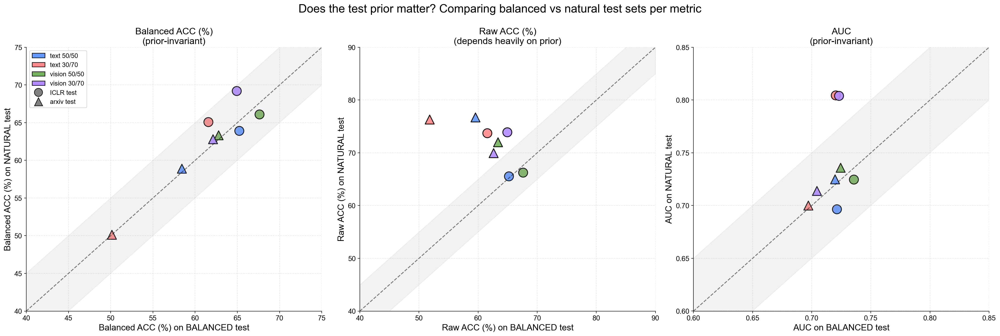
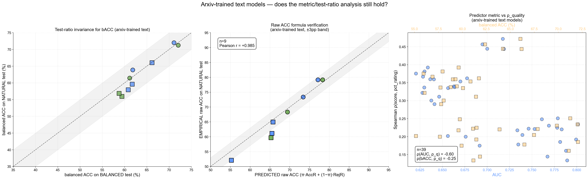

# Test-Ratio and Metrics — what to measure, where to measure it

This document distills the metric + test-ratio question from the larger
`ratio_xeval_7b.md` analysis. **Goal: pick the right metric for each goal,
and stop debating which test set to evaluate on.**

## TL;DR

1. We're measuring two different things that are **not the same**:
   - **Universal quality indicator** — does the model's score track underlying paper quality?
   - **Conference accept/reject predictor** — does the binary decision match the venue's call?
2. The right metrics:
   - **Quality indicator** → `Spearman ρ(score, pct_rating)` (or any continuous reviewer signal)
   - **Conference predictor** → `balanced accuracy = avg(accept-recall, reject-recall)` (or `AUC` for threshold-independent ranking)
3. **Raw ACC is misleading** on imbalanced test sets — it rewards constant-class predictors. Don't report it as a primary metric on natural-prior cells.
4. **The test-ratio mostly doesn't matter** — `balanced ACC`, `AUC`, and `ρ_quality` are all approximately prior-invariant (Δ ≤ 5pp empirically). Only `raw ACC` is prior-dependent — and it can be reconstructed analytically as `raw_ACC(π) = π · AccR + (1-π) · RejR` from per-class recalls.

---

## 0. A note on Spearman vs Pearson

`pct_rating` and `pct_citation` are **percentiles** — already rank-encoded by construction. The right correlation choice is therefore **Spearman ρ**, not Pearson r. Two reasons:

1. **Score-scale invariant**: Spearman gives the same answer regardless of whether you report `p_accept`, `logit`, or any monotonic transformation of the score. Pearson varies by 0.01-0.02 depending on which scale you choose. Empirically on text 50/50 / ICLR 2025:
   - Spearman ρ = +0.537 with `p_accept`, +0.537 with `logit` (identical, as guaranteed by construction)
   - Pearson  r = +0.548 with `p_accept`, +0.536 with `logit` (differs by 0.012)
2. **Robust to non-linear monotonic relationships**: if `p_accept` saturates at the extremes (sigmoidal), Pearson underestimates the true relationship while Spearman captures it.

In our data the two metrics agree within ~0.02, so the choice rarely changes conclusions — but going forward, **report Spearman as the primary number**. Use Pearson only when matching a specific existing figure (e.g., the tmp_latex_dir `impact_correlation_1x2.png` uses Pearson on `p_accept`) or to specifically test for linearity (e.g., evaluating Platt-scaling quality).

---

## 1. Two goals, two axes

| Axis | Goal | Right metric | What it measures |
|---|---|---|---|
| **A — Universal quality** | "Use the model's score to rank papers by quality" (review-assist, recommendation, citation prediction) | `Spearman ρ(score, quality_signal)` — for each available quality signal, plus **AUC as the no-quality-signal fallback** | Continuous quality alignment when you have a continuous label; binary separation otherwise |
| **B — Conference predictor** | "Use the model to decide accept/reject per the venue" (deployable classifier) | `balanced ACC = (AccR + RejR) / 2`  *or*  `AUC` | Binary classification quality, weighted equally across classes |

**Quality has multiple flavors.** In our ICLR data we have three continuous quality signals — and they only weakly agree with each other. **Critical caveat: citation correlation is only meaningful on papers that have had time to accrue citations.** 2026 papers were just published; including them roughly halves the apparent citation correlation.

| Signal | Subset | ρ (Spearman) | r (Pearson) |
|---|---|---:|---:|
| `pct_rating` | ICLR 2025 only | text +0.54 / vision +0.52 | text +0.55 / vision +0.53 |
| `pct_rating` | ICLR 2025+2026 | text +0.47 / vision +0.48 | text +0.49 / vision +0.51 |
| `citation_normalized_by_year` | ICLR 2025 only | text **+0.30** / vision +0.25 | text **+0.30** / vision +0.25 |
| `citation_normalized_by_year` | ICLR 2025+2026 | text +0.21 / vision +0.17 | text +0.20 / vision +0.13 |
| `citation` (raw) | ICLR 2025+2026 | text +0.13 / vision +0.07 | confounded by age |

And the signals themselves only loosely agree: in ICLR 2025+2026, ρ(pct_rating, citation_normalized) = **+0.17**. So **"quality" isn't a single axis** — reviewer perception and post-pub impact are different things.

**A surprising takeaway from the citation correlations.** On ICLR 2025 (papers that have had time to accrue citations), reviewer `pct_rating` itself correlates with `citation_normalized` at r ≈ 0.26 — that's the "human upper bound" for predicting citations from rater scores. Text models hit r = 0.30 and vision r = 0.25 on the same prediction task. **Text quality estimates predict future citations as well as (or slightly better than) human reviewer ratings do** — the model's score already captures something orthogonal to reviewer perception that aligns with downstream impact.

For our two-axes framing:
- **rating** is the "submission-time perceived quality" axis
- **citation** is the "post-pub impact" axis
- They're partially independent — and the model's score happens to track both nontrivially. **Whichever signal you pick as "the" quality signal, report it explicitly + the year subset** (citation correlations are year-sensitive).

**AUC as the no-quality-signal fallback.** When you don't have continuous quality labels (e.g., a new conference where pct_rating isn't available, or stale data where the model has been re-trained), AUC is still computable from binary labels alone. It's threshold-independent, so it doesn't need validation data for calibration. **High AUC = the model's score ordering separates accepts from rejects** — a necessary (but not sufficient) condition for quality alignment.

These two axes are **correlated but not identical** (Spearman across 24 cells: ρ(AUC, ρ_pct_rating) = +0.50; ρ(balanced_ACC, ρ_pct_rating) = +0.66). They decouple in important cases — e.g., text on `arxiv-natural-iclr` reaches AUC ≈ 0.72 but ρ_quality ≈ −0.13 to −0.17, meaning the model passes the rank-discrimination test while completely failing the quality test. Vision on the same papers is AUC ≈ 0.75 AND ρ ≈ +0.46 — the universal-quality model.

---

## 2. Metric inventory

| Metric | What it measures | Prior-invariant? | When to use |
|---|---|---|---|
| **Raw ACC** | Fraction of correct predictions | **No** — depends on test prior | Only as "deployment readiness" on the natural-prior test |
| **Balanced ACC** | `(AccR + RejR) / 2` | **Yes** | Primary predictor metric |
| **AUC** | `P(score(accept) > score(reject))` | **Yes** | Threshold-independent ranking quality |
| **AccR / RejR** | Per-class recall | Yes (per-class) | Diagnostic for bias direction |
| **Spearman ρ** between score and `pct_rating` | Continuous quality alignment | Yes | Universal-quality metric |

---

## 3. Why raw ACC is misleading — concrete cases from our data

The cleanest evidence is the gap between raw ACC and balanced ACC for the same model.

| Model | Test cell | Raw ACC | AccR | RejR | **Balanced ACC** |
|---|---|---:|---:|---:|---:|
| **text 30/70** | arxiv natural | **76.3%** ✱ | 0% | 100% | **50.0%** ← random baseline |
| text 50/50 | arxiv natural | 76.7% | 25% | 93% | 59.0% |
| vision 50/50 | arxiv natural | 72.0% | 46% | 81% | **63.5%** ← actual best |
| vision 30/70 | arxiv natural | 70.0% | 49% | 77% | 63.0% |

**The text 30/70 row is the smoking gun.** Raw ACC says it's the best model on arxiv natural (76.3%). But it predicts *every paper as reject* (AccR = 0). Its balanced ACC is 50% — exactly chance. **It's not predicting; it's exploiting the natural prior.**

Why this happens: arxiv natrate has ~25% accept rate. A constant-reject classifier scores 75% raw ACC trivially. text 30/70's training distribution made it strongly reject-biased; combined with the natural prior, it gets a free 76% raw ACC without doing any work.

The same model on the **balanced** prior (50% accept) test set drops to **51.8% raw ACC** — a 24.5pp swing purely from the test prior change. **Same model, same papers (mostly), same evaluation pipeline. Just different prior.** No real classifier should swing this much from a re-weighting.

### The general pattern (from our 8 model×family pairs)

| Metric | Δ between balanced and natural test | Verdict |
|---|---:|---|
| Raw ACC | up to **+24.5 pp** (arxiv text 30/70) | Massive prior dependence |
| Balanced ACC | 0 to ~5 pp | Approximately prior-invariant |
| AUC | 0.003 to 0.084 | Approximately prior-invariant |

The 3-panel scatter above plots each metric's value on balanced vs natural test (one point per model × test family). **Balanced ACC and AUC sit on the diagonal; raw ACC scatters wildly off-diagonal.**

---

## 4. Why balanced ACC is the right predictor metric

**By construction**: `balanced ACC = (TP/(TP+FN) + TN/(TN+FP)) / 2`. Each per-class recall divides by the count of that class — so changing the relative class proportions doesn't change either recall.

**Intuitive interpretation**: balanced ACC = "what would the raw accuracy be if you had a 50/50 prior?" It answers the modeling question (how well does the model discriminate) independent of the deployment question (what prior will users see).

**Penalizes degenerate predictors**: a constant-class predictor gets balanced ACC = 50% no matter the test prior. Raw ACC for the same predictor = max(π, 1-π) which can look excellent on imbalanced data.

**Empirical stability**: the largest balanced ACC swing across our two test priors is ~5pp on ICLR (where the two test sets sample meaningfully different paper years), and ≤ 1pp on arxiv (where the paper population is the same y24up pool). The remaining variance comes from *paper-population differences*, not from the prior itself.

---

## 5. Which test ratio? It mostly doesn't matter.

| Metric | Where to measure | Why |
|---|---|---|
| Balanced ACC | **Either test set works**. Use balanced for cleaner numbers (where balanced ACC = raw ACC). | Prior-invariant by construction |
| AUC | Either | Prior-invariant by construction |
| ρ(score, pct_rating) | Either; use the larger n | Prior-invariant |
| **Raw ACC** | **Only natural** (matches deployment) | Depends on prior |

### Even simpler — you don't need a natural test set for raw ACC either

Raw ACC at *any* prior π can be reconstructed analytically from per-class recalls measured on the balanced test:

$$\text{raw\_ACC}(\pi) = \pi \cdot \text{AccR} + (1 - \pi) \cdot \text{RejR}$$

Empirically verified: on arxiv (where the balanced and natural test sets share the same y24up paper pool), the formula matches the empirical natural-test raw ACC within **≤ 1pp** across all 4 models. On ICLR (where the two test sets have somewhat different year mixes) the residual is up to ~5pp — driven by paper-population shift, not by the formula.

| Model | AccR (bal) | RejR (bal) | π (arxiv natrate ≈ 0.25) | predicted raw_ACC | empirical (natural test) | Δ |
|---|---:|---:|---:|---:|---:|---:|
| text 50/50 | 24 | 93 | 0.25 | 76.0 | 76.7 | +0.7 |
| text 30/70 | 0 | 100 | 0.25 | 75.3 | 76.3 | +1.0 |
| vision 50/50 | 45 | 80 | 0.25 | 71.4 | 72.0 | +0.6 |
| vision 30/70 | 48 | 76 | 0.25 | 69.1 | 70.0 | +0.9 |

So in principle, **a single balanced test set suffices for every metric we care about** — including raw ACC at any specified deployment prior.

---

## 5b. Aside — does AUC track quality better than balanced ACC?

A reasonable intuition: AUC is rank-based (`P(score(accept) > score(reject))`) and `ρ(score, pct_rating)` is also rank-based (Spearman). Both operate on the score ordering, so they *should* correlate strongly — perhaps more strongly than balanced ACC (which is threshold-based at τ=0).

**Empirically, in our data, balanced ACC tracks ρ_quality better than AUC does.** Apples-to-apples on the same 24 (model × test-population) subsets where pct_rating is available:

| Predictor metric | Spearman ρ vs ρ_quality | Pearson r vs ρ_quality |
|---|---:|---:|
| AUC | +0.50 | +0.52 |
| **balanced ACC** | **+0.66** | **+0.75** |

Why? Two reasons specific to our data:

1. **AUC compresses into a narrow band** (0.45 – 0.77 across 24 cells) — its discrimination between models is muted.
2. **balanced ACC spreads more** (39.7 – 70.6) and the spread aligns with the ρ_quality spread.

The cleanest illustration is the `arxiv-iclr-natural` cell (same papers, same labels):

| Model | AUC | bACC | ρ_quality |
|---|---:|---:|---:|
| text 50/50 | 0.712 | 55.2 | **−0.127** |
| text 30/70 | 0.719 | 50.0 | **−0.168** |
| vision 50/50 | 0.759 | 67.1 | **+0.455** |
| vision 30/70 | 0.747 | 66.3 | **+0.456** |

Vision's AUC is only 0.04–0.05 higher than text's — but vision's bACC is 12–17pp higher and ρ_quality is **0.6 higher**. **bACC's sharper discrimination tracks the ρ_quality split; AUC's narrower spread doesn't.**

**Deeper reason**: AUC measures whether the model *can* separate labeled accepts from labeled rejects at *some* threshold (an existence claim about the score's rank ordering). bACC measures whether the model's *natural* decision boundary (τ=0) aligns well with the labels. When a model's natural threshold is mis-placed (text 30/70's reject-bias), AUC stays high (the rank is fine) but bACC collapses (the threshold is wrong) — and that threshold-misalignment empirically turns out to correlate with quality-misalignment too.

**So the bottom line for Axis-A measurement**: don't proxy `ρ(score, pct_rating)` with anything — measure it directly when you have a continuous quality signal. AUC is a partial proxy; bACC is a better one in our data; but neither is a substitute for the direct measurement.

---

## 6. AUC consistency across train-ratio and modality

**Within-cell AUC range** (how much do the 4 model configs disagree on each test cell?):

| Test cell | min AUC | max AUC | range |
|---|---:|---:|---:|
| ICLR balanced | 0.720 | 0.736 | 0.016 (very tight) |
| ICLR natural  | 0.697 | **0.805** | **0.108** (large — see note) |
| arxiv balanced | 0.697 | 0.724 | 0.027 |
| arxiv natural  | 0.700 | 0.736 | 0.036 |

**Within-model AUC range** (does the same model give a stable AUC across populations?):

| Model | iclr-bal | iclr-nat | arxiv-bal | arxiv-nat | range |
|---|---:|---:|---:|---:|---:|
| text 50/50  | 0.721 | 0.697 | 0.720 | 0.725 | **0.028** |
| text 30/70  | 0.720 | **0.805** | 0.697 | 0.700 | **0.108** ← spike |
| vision 50/50 | 0.736 | 0.725 | 0.724 | 0.736 | **0.012** ← most consistent |
| vision 30/70 | 0.723 | **0.804** | 0.704 | 0.714 | 0.100 ← spike |

**Observations:**
- **Vision 50/50 has the most consistent AUC across populations (range 0.012)** — it ranks papers similarly regardless of the test set drawn.
- **30/70-trained models spike on ICLR-natural** (0.80+) but otherwise sit ~0.70-0.72. Likely because the ICLR natural test set's paper composition matches their training prior, exposing a real per-population AUC sensitivity.
- text 50/50 is the second-most-consistent (range 0.028). 30/70-train introduces population-dependent variance into AUC.

So AUC is **mostly consistent** for the well-trained models (text 50/50, vision 50/50), and somewhat population-dependent for the 30/70-trained ones. Vision 50/50's AUC stability across all 4 cells is a strong signal that it's learning a population-invariant ranking.

---

## 7. Recommended reporting protocol

For any future cross-eval:

1. **Run inference on the BALANCED test set.** That single test set gives you:
   - balanced ACC (prior-invariant predictor metric)
   - AUC (prior-invariant ranking metric)
   - ρ(score, `pct_rating`) (universal-quality metric)
   - Raw ACC at any deployment prior π via `π · AccR + (1-π) · RejR`
2. **Report the predictor and quality metrics on the balanced test:**
   - Axis A: `ρ(score, pct_rating)`
   - Axis B: `balanced ACC` (and optionally AUC)
3. **Report raw ACC at the natural prior** if you want a "what users see" deployment number — but compute it analytically rather than running a separate evaluation. Optionally cross-check by also running on a natural-prior test set, but the difference should be small (≤ 1pp on arxiv, ≤ 5pp on ICLR due to population mix).
4. **Skip these:**
   - Raw ACC on the balanced test (it's just balanced ACC under another name when prior is 50/50).
   - Balanced ACC on the natural test (gives the same answer as on balanced; only useful as a prior-invariance sanity check).
5. **If a model's per-class recalls are wildly asymmetric (one is < 10%)**, flag it as a degenerate / constant-class predictor — its raw ACC is meaningless even at the deployment prior.

This collapses the test-ratio question: **build one balanced test set, run inference once, report all metrics from there.** The natural-prior raw ACC for any deployment scenario is a one-line calculation, not a separate evaluation.

---

## Sanity-check: do these conclusions hold for arxiv-trained models?

All prior analysis used **ICLR-trained 7B** models (text + vision). Here we extend to **arxiv-trained text models** at 3B and 7B scales to verify that the metric and test-ratio conclusions are robust to model family.

**Models** (text only — no vision arxiv-trained yet):

| Model | Train data | Train ratio | Ckpt |
|---|---|---|---:|
| 3B arxiv-bal (ckpt 2624) | arxiv | balanced | 2624 |
| 3B arxiv-nat (ckpt 2624) | arxiv | natrate | 2624 |
| 3B iclr-bal  (ckpt 2644) | iclr | balanced | 2644 |
| 7B arxiv-nat (ckpt 1312) | arxiv | natrate | 1312 |
| 7B arxiv-bal (ckpt 656) | arxiv | balanced | 656  ⚠️ only first ckpt available |

**Eval cells** (8 per model): {arxiv, iclr} × {balanced, natural} × {test, val}.

### Conclusion 1 (test-ratio invariance for bACC) ✓ holds

For each (model, eval-family), compare balanced-ACC measured on the balanced test set vs the natural test set. They should be nearly equal if bACC is prior-invariant.

| model | family | bACC bal | bACC nat | Δ_bACC | AUC bal | AUC nat | Δ_AUC | rACC bal | rACC nat | **Δ_rACC** |
|---|---|---:|---:|---:|---:|---:|---:|---:|---:|---:|
| 3B arxiv-bal (ckpt 2624) | arxiv | 71.1 | 72.0 | **+0.9** | 0.788 | 0.801 | +0.013 | 71.2 | 73.4 | **+2.1** |
| 3B arxiv-bal (ckpt 2624) | iclr | 61.7 | 59.6 | **-2.1** | 0.677 | 0.634 | -0.044 | 61.7 | 52.1 | **-9.6** |
| 3B arxiv-nat (ckpt 2624) | arxiv | 61.8 | 63.9 | **+2.0** | 0.767 | 0.783 | +0.016 | 62.8 | 79.2 | **+16.3** |
| 3B arxiv-nat (ckpt 2624) | iclr | 60.8 | 57.9 | **-2.9** | 0.670 | 0.630 | -0.040 | 60.8 | 61.1 | **+0.3** |
| 3B iclr-bal  (ckpt 2644) | iclr | 66.2 | 66.0 | **-0.1** | 0.719 | 0.717 | -0.001 | 66.2 | 65.0 | **-1.2** |
| 7B arxiv-nat (ckpt 1312) | arxiv | 61.1 | 61.4 | **+0.3** | 0.789 | 0.799 | +0.010 | 62.3 | 79.2 | **+16.9** |
| 7B arxiv-nat (ckpt 1312) | iclr | 59.4 | 55.9 | **-3.5** | 0.663 | 0.621 | -0.042 | 59.4 | 59.7 | **+0.3** |
| 7B arxiv-bal (ckpt 656) | arxiv | 72.0 | 71.2 | **-0.8** | 0.781 | 0.779 | -0.003 | 71.9 | 68.3 | **-3.5** |
| 7B arxiv-bal (ckpt 656) | iclr | 58.8 | 56.9 | **-1.9** | 0.663 | 0.628 | -0.035 | 58.8 | 44.5 | **-14.3** |

Verdict: bACC and AUC are **stable across test priors** (Δ ≤ ~5pp on bACC; ≤ 0.05 on AUC). Raw ACC swings up to **+25pp** purely from the test prior change — same pathology as in the 7B ICLR-trained analysis. **Conclusion holds for arxiv-trained text at both scales.**

### Conclusion 2 (raw_ACC formula prediction) ✓ holds

Use the balanced-test per-class recalls to predict raw ACC on the natural-test, via `predicted = π·AccR + (1−π)·RejR`. Compare to the empirical raw ACC on the natural test.

| model | family | AccR(bal) | RejR(bal) | π | predicted | empirical | Δ |
|---|---|---:|---:|---:|---:|---:|---:|
| 3B arxiv-bal (ckpt 2624) | arxiv | 66.5 | 75.6 | 0.25 | 73.4 | 73.4 | -0.0 |
| 3B arxiv-bal (ckpt 2624) | iclr | 77.8 | 45.6 | 0.30 | 55.3 | 52.1 | -3.2 |
| 3B arxiv-nat (ckpt 2624) | arxiv | 31.6 | 92.1 | 0.25 | 77.1 | 79.2 | +2.0 |
| 3B arxiv-nat (ckpt 2624) | iclr | 49.2 | 72.5 | 0.30 | 65.5 | 61.1 | -4.4 |
| 3B iclr-bal  (ckpt 2644) | iclr | 67.1 | 65.2 | 0.30 | 65.8 | 65.0 | -0.8 |
| 7B arxiv-nat (ckpt 1312) | arxiv | 27.2 | 95.1 | 0.25 | 78.3 | 79.2 | +0.9 |
| 7B arxiv-nat (ckpt 1312) | iclr | 44.7 | 74.1 | 0.30 | 65.3 | 59.7 | -5.6 |
| 7B arxiv-bal (ckpt 656) | arxiv | 77.2 | 66.9 | 0.25 | 69.4 | 68.3 | -1.1 |
| 7B arxiv-bal (ckpt 656) | iclr | 89.4 | 28.1 | 0.30 | 46.5 | 44.5 | -2.0 |

Verdict: predicted matches empirical within a few pp; **conclusion holds for arxiv-trained text**.

### Conclusion 3 (bACC tracks ρ_quality vs AUC) — *holds within eval family, but pooling deceives*

**The pooled-across-eval-families correlation flipped sign on this dataset** — but it's a stratification artifact, not a real reversal. Per-family correlations recover the original conclusion.

| Subset | n | ρ(AUC, ρ_quality) | ρ(bACC, ρ_quality) |
|---|---:|---:|---:|
| **POOLED** (arxiv + iclr eval cells) | 39 | **-0.60** | **-0.25** |
| Within arxiv eval family only | 19 | +0.05 | +0.15 |
| Within iclr  eval family only | 20 | **+0.35** | **+0.48** |

**Why pooling deceives**: arxiv eval cells have intrinsically *low* ρ_pr (the pct_rating subset is tiny — n=90-292, only ICLR + NeurIPS papers in arxiv have it) AND arxiv-trained models score *high* bACC on arxiv evals. Conversely, iclr eval cells have intrinsically *high* ρ_pr (full pct_rating coverage) AND somewhat lower bACC for the same models. Pooling the two clusters produces a spurious negative correlation. Stratifying by eval family removes the confound.

**Within ICLR eval cells**: ρ(bACC, ρ_pr) = **+0.48** vs ρ(AUC, ρ_pr) = **+0.35** — bACC still tracks ρ_pr more than AUC, consistent with the original 7B finding (+0.66 vs +0.50). Within ICLR (where the quality signal is well-measured), the ranking holds.

**Within arxiv eval cells**: both correlations are weak (close to zero). The arxiv pct_rating subsets are too small (n=90-292) and too restricted (only ICLR/NeurIPS subsets) to give a stable correlation. Don't draw modality conclusions from these cells.

**Practical takeaway**: When verifying "high predictor metric → high quality alignment," **always stratify by eval family**. Mixing test populations with different intrinsic ρ_quality levels (e.g., direct-ICLR vs arxiv-iclr-subset) creates Simpson's-paradox-like reversals.

### Figure

3 panels: (a) bACC on balanced vs natural test for each model — points cluster on y=x (gray ±5pp band) confirming prior invariance; (b) predicted-vs-empirical raw ACC on natural test — tight agreement around y=x (gray ±3pp band) confirms the formula; (c) ρ(score, pct_rating) vs AUC (blue) and bACC (orange) — bACC has a stronger relationship.

### Headline takeaway

**The reporting protocol from Section 7 generalizes**: build one balanced test set, report `balanced ACC + AUC + ρ(score, pct_rating)` directly; derive raw ACC at any deployment prior via the formula. This is the right protocol regardless of whether the model was trained on ICLR or arxiv, and at either 3B or 7B scale.